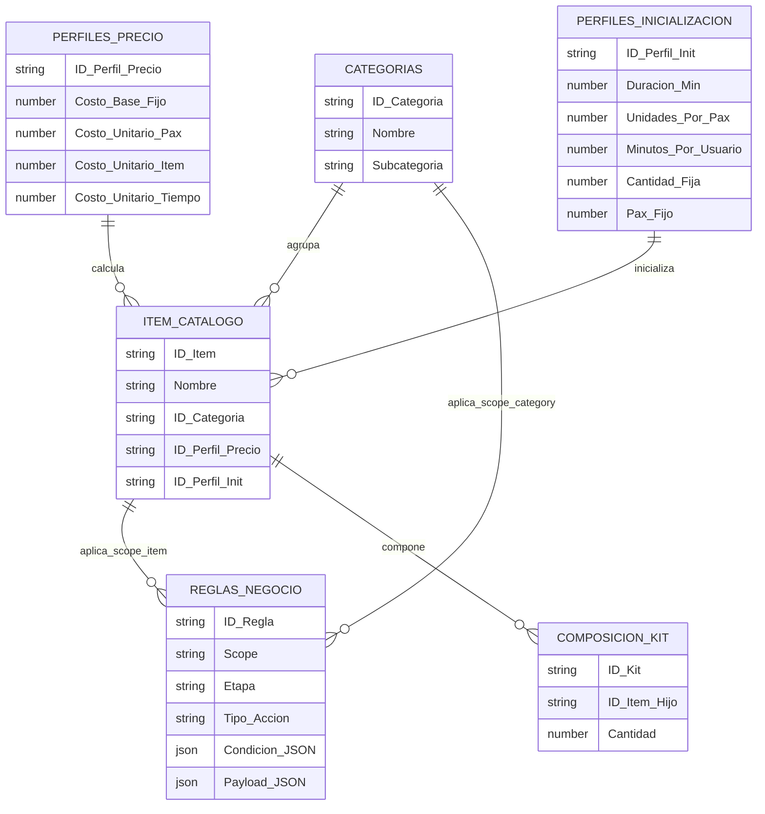

# Data Model

Resumen general del modelo de datos para el cotizador de eventos corporativos en hotel.

## Entidades principales

- `CATEGORIAS`: agrupa items en familias funcionales/comerciales.
- `ITEM_CATALOGO`: entidad central del catalogo; representa un producto, servicio o politica cotizable.
- `PERFILES_PRECIO`: define como se calcula el precio de un item.
- `PERFILES_INICIALIZACION`: define con que cantidades o defaults entra un item a una cotizacion.
- `REGLAS_NEGOCIO`: restricciones, warnings y condiciones de aplicacion.
- `COMPOSICION_KIT`: extension futura para bundles o kits compuestos por varios items.

## Diagrama ER

## Lectura rapida

- `ITEM_CATALOGO` es el nodo central del modelo.
- Cada item pertenece a una categoria.
- Cada item resuelve su precio a traves de un perfil reutilizable.
- Cada item puede tener un perfil de inicializacion para defaults de cantidad, pax o duracion.
- Las reglas pueden aplicar directamente al item o a toda una categoria, segun su `Scope`.

## Diagramas relacionados

- `DATA_CATEGORIZATION.drawio` - mapa visual de subcategorias, categorias fuente y ejemplos de items.
- `DATA_CATEGORIZATION.mup` - mapa mental MindMup con jerarquia correcta: subcategoria -> categoria fuente -> items.
