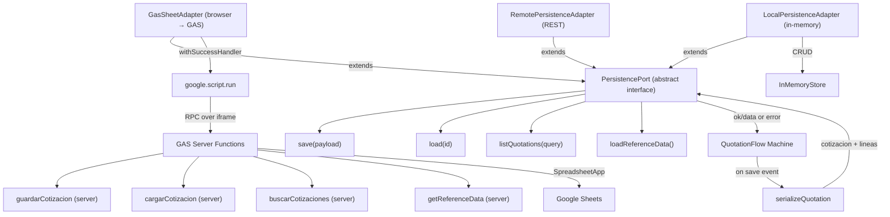

# Migration: GAS Server-Side Functions

## What

`GasSheetAdapter` in dev (`dev/src/adapters/gas/db/GasSheetAdapter.js`) calls four GAS server methods via `google.script.run`:

```
guardarCotizacionV2  (fallback: guardarCotizacion)
cargarCotizacionV2   (fallback: cargarCotizacion)
buscarCotizacionesV2 (fallback: buscarCotizaciones)
getReferenceDataV2   (fallback: getReferenceData)
```

**These V2 functions are generated into `gas/Code.gs` by `npm run build`** (via `src/adapters/gas/bundling/generate_gas_code.mjs`). They exist as stubs but call `getSheetDB()` — a helper that must be implemented to wrap `SpreadsheetApp` for the new 12-table schema. Without that backing implementation the functions will throw at runtime.

The legacy equivalents (`servicioGuardarCotizacion`, `servicioCargarCotizacion`) exist and work, but speak the old schema (4 flat tables). The adapter will fall through to the legacy names only if the V2 names are not found — and the response shapes do not match what `normalizeSaveResponse` / `normalizeLoadResponse` expect.

## Why it matters

Until the GAS server-side functions are implemented in the new schema, the production deploy (which runs inside a Google Apps Script container) cannot save or load quotations. The dev local server works because it uses `LocalPersistenceAdapter` instead. This is the primary gap blocking a production release.

## Persistence layer



## What legacy does (reference)

### `servicioGuardarCotizacion(datosCliente, carrito, idExistente)`
1. Find-or-create client (`crearOObtenerCliente`)
2. Sum totals from `carrito[]`
3. `Cotizacion.create({ID_Cliente, Cant_Personas, Total_Neto, Estado})`
4. `DetalleCotizacion.insertBatch(idCotizacion, carrito)` — each item as `{Item, Timestamp_Evento, Cantidad, Precio_Unitario_Aplicado, Total_Linea}`
5. Returns `{success: true, id}`

### `servicioCargarCotizacion(idCotizacion)`
1. `Cotizacion.getConDetalle(id)` — eager loads detalles + cliente
2. Normalizes `Timestamp_Evento` (handles both `Date` objects and strings from Sheets via the `replace(/-/g, '/')` trick)
3. Sorts items chronologically
4. Determines `fechaBase` = earliest item date
5. Computes `diaRelativo = ceil((itemDate - base) / msPerDay) + 1`
6. Returns `{success: true, cliente, carrito[], fechaInicio}`

## How to implement the V2 functions

Each server function should return the `{ ok: true, data: {...} }` envelope that `GasSheetAdapter`'s normalizers expect.

### `guardarCotizacionV2(payload)`

`payload` = `{ cotizacion: COTIZACIONES_row, lineas: LINEA_DETALLE_rows[] }` — exactly what `serializeQuotation()` produces.

```javascript
function guardarCotizacionV2(payload) {
  try {
    const db = getSheetDB(); // your SheetDB wrapper for the new schema
    const { cotizacion, lineas } = payload;

    // upsert COTIZACIONES row
    const existing = db.COTIZACIONES.find(r => r.ID_Cotizacion === cotizacion.ID_Cotizacion);
    if (existing) db.COTIZACIONES.update({ ...existing, ...cotizacion });
    else          db.COTIZACIONES.insert(cotizacion);

    // replace LINEA_DETALLE rows
    db.LINEA_DETALLE.where(r => r.ID_Cotizacion === cotizacion.ID_Cotizacion)
                    .forEach(r => db.LINEA_DETALLE.deleteRow(r._rowIndex));
    lineas.forEach(l => db.LINEA_DETALLE.insert(l));

    return { ok: true, data: { quotationId: cotizacion.ID_Cotizacion, lineCount: lineas.length } };
  } catch (e) {
    return { ok: false, error: { code: 'STORAGE_ERROR', message: e.message } };
  }
}
```

### `cargarCotizacionV2(quotationId)`

```javascript
function cargarCotizacionV2(quotationId) {
  try {
    const db = getSheetDB();
    const cotizacion = db.COTIZACIONES.find(r => r.ID_Cotizacion === quotationId);
    if (!cotizacion) return { ok: false, error: { code: 'NOT_FOUND', message: 'Not found' } };

    const lineas = db.LINEA_DETALLE.where(r => r.ID_Cotizacion === quotationId)
                                   .sort((a, b) => a.Dia_Numero - b.Dia_Numero);

    return { ok: true, data: { quotationId, cotizacion, lineas, lineCount: lineas.length } };
  } catch (e) {
    return { ok: false, error: { code: 'STORAGE_ERROR', message: e.message } };
  }
}
```

### `buscarCotizacionesV2(query)`

```javascript
function buscarCotizacionesV2(query) {
  const term = (query?.term || '').toLowerCase();
  const limit = query?.limit || 25;
  const db = getSheetDB();

  let items = db.COTIZACIONES.all().map(cot => {
    const client = db.CLIENTES.find(c => c.ID_Cliente === cot.ID_Cliente);
    return {
      quotationId: cot.ID_Cotizacion,
      clientId: cot.ID_Cliente,
      clientName: client?.Nombre_Empresa || '',
      pax: cot.Pax_Global,
      quotationDate: cot.Fecha_Evento,
      updatedAt: cot.Updated_At
    };
  });

  if (term) items = items.filter(i =>
    [i.quotationId, i.clientName, i.quotationDate].some(v => String(v).toLowerCase().includes(term))
  );

  items.sort((a, b) => String(b.updatedAt).localeCompare(String(a.updatedAt)));
  items = items.slice(0, limit);

  return { ok: true, data: { items, count: items.length } };
}
```

### `getReferenceDataV2()`

Returns all catalog/config tables as `seedEntries` so the browser can hydrate `InMemoryStore` without additional round-trips:

```javascript
function getReferenceDataV2() {
  const db = getSheetDB();
  const tables = ['CLIENTES','CATEGORIAS','ITEM_CATALOGO','PERFILES_PRECIO',
                  'PERFILES_INICIALIZACION','REGLAS_NEGOCIO','COMPOSICION_KIT'];
  const seedEntries = tables.map(t => ({ table: t, records: db[t].all() }));
  return { ok: true, data: { seedEntries, tableCount: seedEntries.length } };
}
```

## Schema differences to handle

| Legacy field | New schema | Note |
|---|---|---|
| `DETALLE_COTIZACION.Item` | `LINEA_DETALLE.ID_Item` | FK to `ITEM_CATALOGO`; join needed to get name |
| `DETALLE_COTIZACION.Timestamp_Evento` | `LINEA_DETALLE.Dia_Numero + Hora_Inicio` | Relative day; no absolute timestamp stored |
| `DETALLE_COTIZACION.Cantidad` | `LINEA_DETALLE.Override_Pax` (nullable) | Falls back to `COTIZACIONES.Pax_Global` |
| `COTIZACIONES.Total_Neto` | Computed at read time | Not stored; sum line totals on load |
| `COTIZACIONES.Link_PDF` | Removed | Use `Estado = Finalizada` + Drive URL separately |

## Real gap — what's actually missing

The four V2 function stubs are already in `gas/Code.gs` (generated). What is missing:

- `getSheetDB()` helper — a `SpreadsheetApp`-backed wrapper for each of the 12 new tables (`COTIZACIONES`, `LINEA_DETALLE`, `CLIENTES`, `ITEM_CATALOGO`, etc.). This is the only thing standing between the generated stubs and a working production deploy.
- The reference implementations in this doc can be used as drop-in bodies for those stubs once `getSheetDB()` is available.

The GAS entry point at `dev/src/adapters/gas/bundling/entry.js` already exports the V2 names — no changes needed there.
