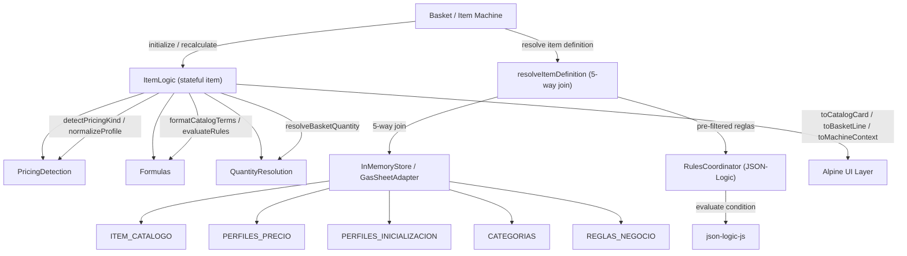
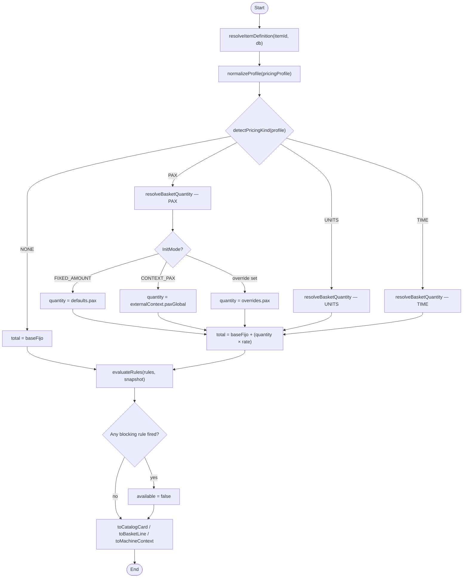

# Pricing Engine

How item prices are calculated in `dev/src/services/pricing/`.

## Component map



## Calculation flow



## Key concepts

### PricingKind
How the variable dimension of an item's price is driven:

| Kind | Driver | Example |
|---|---|---|
| `NONE` | No variable component | Salon Chinook: $385.000 flat |
| `PAX` | Per person | Desayuno: $12.500 × pax |
| `UNITS` | Per unit | Vino Castillo Molina: $13.025/bottle |
| `TIME` | Per minute | (reserved for timed services) |

Detection priority: PAX > UNITS > TIME > NONE, based on which `Costo_Unitario_*` field in `PERFILES_PRECIO` is non-zero.

### InitializationMode
How the **default quantity** is resolved when the item is first dropped into the basket — before the user overrides anything:

| Mode | Source of quantity |
|---|---|
| `NONE` | No quantity applies (FLAT items) |
| `FIXED_AMOUNT` | Hardcoded in `PERFILES_INICIALIZACION` (e.g. `Pax_Fijo = 30`) |
| `CONTEXT_PAX` | Inherits `paxGlobal` from the quotation settings |
| `CONTEXT_TIME` | Inherits `duracionMin` from the quotation settings |

### Price formula

```
total = Costo_Base_Fijo + (quantity × rate)
```

where `rate` is `Costo_Unitario_Pax`, `Costo_Unitario_Item`, or `Costo_Unitario_Tiempo` depending on `PricingKind`.

### Profile normalization
`normalizeProfile()` accepts both camelCase (`baseFijo`, `porPersona`) and schema-style (`Costo_Base_Fijo`, `Costo_Unitario_Pax`) keys, so `ItemLogic` can be seeded directly from a `PERFILES_PRECIO` row.

### Two rule engines
There are currently two co-existing rule mechanisms:

| Engine | Format | Used by |
|---|---|---|
| `evaluateRules()` in `Formulas.js` | `{type: 'MAX_PAX'/'MIN_PAX'/'ONLY_HOUR_RANGE', value, active, blocking}` | `ItemLogic.recalculate()` directly |
| `RulesCoordinator` | JSON-Logic (`{Condicion_JSON, Payload_JSON, Scope, Etapa}`) | `resolveItemDefinition()` → future pipeline |

The `RulesCoordinator` is the intended long-term path (it supports arbitrary conditions via JSON-Logic), but it is **not yet wired into `ItemLogic`** — `ItemLogic` still calls `evaluateRules()` with the simpler format. The transition is pending.

## Data flow from extracted catalog

The extracted `pricing.csv` maps to `PERFILES_PRECIO` as:

| pricing.csv field | PERFILES_PRECIO column |
|---|---|
| `base_value` | `Costo_Base_Fijo` |
| `variable_value` (when `expression_type = per_person` or `base_plus_variable`) | `Costo_Unitario_Pax` |
| `variable_value` (when `expression_type = per_unit`) | `Costo_Unitario_Item` |

Key files: `dev/src/services/pricing/item/`
