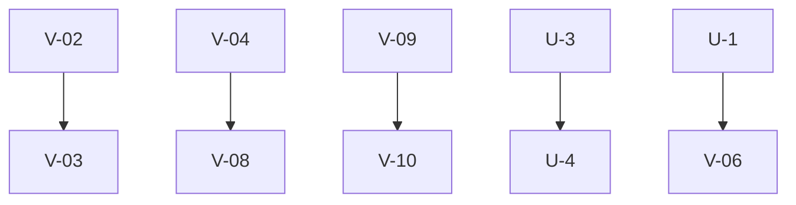

# Tasks Board

> Single entry point for all active work. Read this before starting any task.

## Active (status=open|in_progress)

| ID | Domain | Task | Priority | Depends On | Pills |
|----|--------|------|----------|------------|-------|
| V-03 | editor | Time Adjustment (Resize) | P1 | V-02 | pill-timeline-gestures |
| V-04 | quotation | Groups / Packs Logic | P1 | | pill-kits-logic |
| U-4 | quotation | PDF Export | P1 | U-3 | pill-pdf-generation-strategy |
| V-06 | quotation | Excel Export | P2 | U-1 | pill-excel-export-strategy |
| V-07 | quality | Detail Hover | P2 | | pill-rules-hover |
| V-08 | database | Pack Editor UI | P3 | V-04 | pill-pack-editor-ui |
| V-09 | pricing | Rule Visualizers | P3 | | pill-rule-graphs |
| V-10 | database | Rule Creator UI | P3 | V-09 | pill-rule-creator-ui |

## Completed

| ID | Domain | Task | Completed |
|----|--------|------|----------|
| V-03 | editor | Time Adjustment (Resize) | 2026-04-16 |
| V-01 | quotation | Item Comments | 2026-04-16 |
| V-02 | editor | Time Adjustment (Move) | 2026-04-16 |
| U-2 | editor | Editor Basic | 2026-04-15 |
| U-5 | quality | Source Code Quality Check | 2026-04-15 |
| U-1 | persistence | Save Vertical Slice | 2026-04-15 |

## Blocked (status=blocked)

| ID | Domain | Task | Reason |
|----|--------|------|--------|
| U-4 | quotation | PDF Export | Depends on U-3 |

## Ready to Promote (from drawers/)

No items pending promotion.

---

## Current Priority

1. V-03 (Time Adjustment - Resize)
2. V-04 (Groups / Packs Logic)
3. U-4 (PDF Export)

## Dependency Graph

## Execution Order

1. V-04, V-07, V-09 (Parallelizable)
2. V-03 (Depends on V-02, which is completed)
3. V-08 (Depends on V-04)
4. V-10 (Depends on V-09)
5. V-06 (Depends on U-1)
6. U-4 (Depends on U-3)
