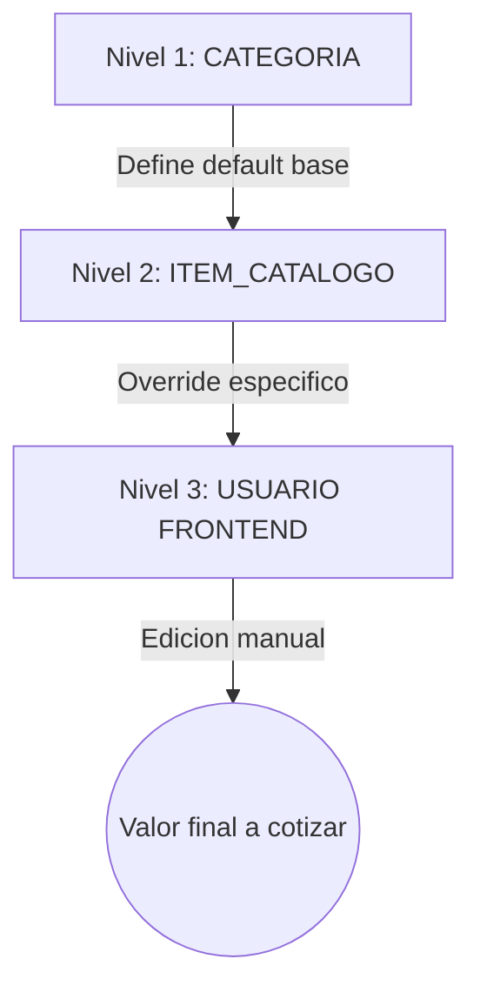

# Arquitectura y Logica de Datos: SF Lodge v3.0

Este documento sintetiza toda la evolucion del sistema, desde la estructura de base de datos hasta el pipeline de calculo, consolidando las reglas de negocio, herencias y motores de procesamiento.

## Proposito

Definir como fluye la informacion en el sistema, como se estructuran las entidades y como interactuan los distintos motores logicos para generar una cotizacion precisa.

## 1. Paradigma Arquitectonico

El sistema SF Lodge v3.0 opera bajo dos paradigmas principales:

- `Schema-Driven Development`: toda la estructura de la base de datos (tablas, columnas, validaciones y llaves foraneas) vive en `src/Config/Config_Schema.js`. El sistema utiliza este esquema para validar datos, generar modelos y conectar la persistencia.
- `Separacion estricta de datos`:
  - `Master Data` (cache en memoria): entidades de configuracion como categorias, items y reglas. Se leen al inicio y se reutilizan durante la sesion.
  - `Transactional Data` (lectura/escritura activa): entidades operativas como cotizaciones, lineas e historial. Se consultan y persisten bajo demanda.

## 2. Ecosistema de Entidades (Modelo de Datos)

### A. Capa de Configuracion (Las reglas)

- `CATEGORIAS`: define el comportamiento base de un tipo de servicio (si usa horas, cantidad, pax y defaults sugeridos).
- `REGLAS_CALCULO_CANTIDAD`: define algoritmos de prellenado de cantidad (por ejemplo, fijo o por pax).
- `REGLA_PRECIO`: almacena los coeficientes de cobro (base, pax, tiempo, cantidad).
- `REGLAS_IMPUESTO`: define tasas tributarias configurables (por ejemplo IVA, ILA, exento).

### B. Capa de Catalogo (El inventario)

- `ITEM_CATALOGO`: productos/servicios vendibles; heredan configuracion de categoria con posibilidad de override.
- `COMPOSICION_KIT`: relacion padre-hijo para packs/kits; define si un hijo suma precio o queda absorbido.
- `REGLAS_DESCUENTO`: descuentos automaticos (gatillados por carrito) o manuales (aplicados por vendedor).
- `RESTRICCION`: validaciones de negocio (minimos, incompatibilidades, requerimientos).

### C. Capa Transaccional (La operacion)

- `COTIZACIONES`: encabezado de evento (cliente, fechas, estado, totales).
- `LINEA_DETALLE`: relacion item-cotizacion con inputs/overrides y snapshot de calculo aplicado.
- `HISTORIAL_COTIZACION`: bitacora inmutable de auditoria por usuario/accion.

## 3. Cascada de Defaults (Resolucion de Variables)

Para resolver variables antes del pricing, el sistema usa una herencia en 3 niveles para `Q` (cantidad) y `T` (tiempo):

Ejemplo (cantidad de bebidas):

1. Categoria Bebestibles: regla por pax (`FACTOR_PAX = 1.0`).
2. Item Vino Reserva: override a `FACTOR_PAX = 0.33`.
3. Evento con 30 pax: UI sugiere 10 botellas.
4. Usuario ajusta a 15: el valor final usado por pricing es 15.

## 4. Motores Centrales

### I. Pricing Engine

Formula universal:

`Precio = Base + (P * C_p) + (T * C_t) + (Q * C_q)`

Donde `P` = pax, `T` = tiempo y `Q` = cantidad. Los coeficientes provienen de la `REGLA_PRECIO` efectiva del item.

### II. Discount Engine

Aplica descuentos sin mutar el precio original del item, agregando lineas negativas al resultado de cotizacion. Evalua triggers y calcula descuentos por pax, fijos o porcentuales.

### III. Tax Engine

Calcula impuestos por linea segun la regla tributaria aplicable (propia del item o heredada). Persiste snapshot de tasa para trazabilidad contable.

### IV. Constraint Validator

Valida el carrito final contra `RESTRICCION`. Entrega errores bloqueantes o advertencias (por ejemplo, minimos de pax o incompatibilidades).

## 5. Pipeline de Calculo de Cotizacion

Cada cambio de carrito ejecuta un flujo ordenado:

1. `Inicializacion`: define contexto base (`Pax_Global`, `Duracion_Dias`, fecha, etc.).
2. `Fase 1 - Expansion`: descompone kits recursivamente desde `COMPOSICION_KIT` hasta obtener lineas operativas.
3. `Fase 2 - Valorizacion`:
   - resuelve `Q` y `T` con cascada de defaults,
   - calcula neto por linea con `Pricing Engine`.
4. `Fase 3 - Ajuste`: `Discount Engine` agrega descuentos aplicables.
5. `Fase 4 - Tributacion`: `Tax Engine` calcula impuestos por linea y consolida desglose.
6. `Agregacion`: consolida neto, impuestos y `Total_Final`.
7. `Fase 5 - Auditoria`: `Constraint Validator` revisa reglas globales y habilita/bloquea guardado.

## Implementacion y Limites

- El pricing debe ejecutarse como logica determinista y testeable.
- La persistencia se abstrae via `packages/database` (`IStore`, adapters, modelos).
- La orquestacion controla lectura/escritura y entrega datos al pipeline sin acoplar calculo a infraestructura.

## Referencias Relacionadas

- `docs/PACKAGES/database.md`
- `docs/PACKAGES/pricing.md`
- `docs/PACKAGES/xstate.md`
- `src/Config/Config_Schema.js`

---

Si necesitas, el siguiente paso natural es mapear esta arquitectura a archivos concretos del codigo (funcion por funcion) para mantener trazabilidad entre diseno y runtime.
