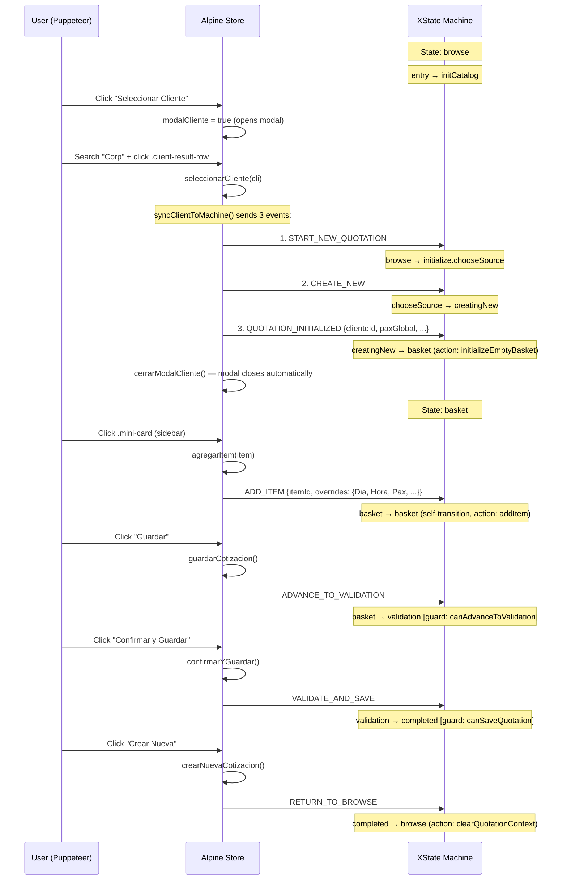

# UI Testing with Puppeteer — Step-by-Step Guide

This guide walks through every screen of the Cotizador Lodge UI using Puppeteer MCP.
Follow each step in order. The app is state-machine-driven — screens only appear after
the correct XState transitions.

> **Verified:** Every step in this guide has been executed against the live app and confirmed working.

---

## 1. Setup

### Start the server

```bash
cd /home/jp/CotizadorLodge/claps_codelab && npm run dev
# Builds bundle + GAS workspace, then serves on http://localhost:8082
# Wait for "Listening on http://localhost:8082" before proceeding
```

If already built, use `npm run serve:gas` instead (skips rebuild).

### Puppeteer launch config

```javascript
puppeteer_navigate({
  url: "http://localhost:8082",
  launchOptions: { args: ["--no-sandbox"] },
  allowDangerous: true
})
```

**IMPORTANT — `allowDangerous: true` is required** when using `--no-sandbox` on Linux.

### Critical Puppeteer MCP Constraints

These constraints were discovered during live testing and are mandatory:

1. **No `await`** — Puppeteer MCP's `evaluate` does NOT support top-level `await`. Use `.then()` chains or wrap in an async IIFE:
   ```javascript
   // WRONG — will error:
   await new Promise(r => setTimeout(r, 1000));

   // CORRECT — use .then():
   new Promise(r => setTimeout(r, 1000)).then(() => 'done');
   ```

2. **Wrap in IIFE** — Variables declared at top level persist across evaluations. Re-declaring `const btns` will throw `Identifier already declared`. Always use IIFE:
   ```javascript
   // WRONG — second call will error:
   const btns = [...document.querySelectorAll('button')];

   // CORRECT — wrap in IIFE:
   (() => {
     const btns = [...document.querySelectorAll('button')];
     return btns.length;
   })();
   ```

3. **Store name is `'cotizadorApp'`** — NOT `'app'`. The Alpine store is registered via:
   ```javascript
   Alpine.store('cotizadorApp')   // CORRECT
   Alpine.store('app')            // WRONG — returns undefined
   ```

4. **Machine state includes both parallel regions** — separated by ` | `:
   ```
   "quotation_workflow.browse | database_management.closed"
   ```
   The `.includes('browse')` checks still work correctly.

---

## 2. Seeded Test Data Reference

The local server uses `InMemoryStore` with seeded data. These IDs are stable:

| Type | ID | Name | Details |
|------|----|------|---------|
| Client | `CLI_CORP` | Corporacion SF | RUT: 76.100.001-1 |
| Client | `CLI_DEMO` | Demo Empresa | RUT: 76.222.222-2 |
| Client | `CLI_TEST` | Test Cliente | RUT: 76.333.333-3 |
| Category | `CAT_CAFE` | CAT_CAFE | 3 items (Coffee Intermedio, Coffee Basico, Pack Cafe Completo) |
| Category | `CAT_SALONES` | CAT_SALONES | 2 items |
| Category | `CAT_COMIDAS` | CAT_COMIDAS | 2 items |

Total catalog: **7 items** across **3 categories**.

---

## 3. State Machine — Full Diagram

### 3.1 XState Blueprint (Mermaid)

The machine is **parallel** with two independent regions running simultaneously.

```mermaid
stateDiagram-v2
    state quotationApp {
        direction LR

        state "Region 1: quotation_workflow" as R1 {
            [*] --> browse

            state browse {
                note right of browse
                    entry / initCatalog
                end note
            }

            state quotation {
                [*] --> initialize

                state initialize {
                    [*] --> chooseSource
                    chooseSource --> loadingPrevious : LOAD_PREVIOUS
                    chooseSource --> creatingNew : CREATE_NEW
                    loadingPrevious --> basket : QUOTATION_LOADED\n/ initializeBasketFromLoaded
                    loadingPrevious --> error : ERROR\n/ captureError
                    creatingNew --> basket : QUOTATION_INITIALIZED\n/ initializeEmptyBasket
                    creatingNew --> error : ERROR\n/ captureError
                }

                state basket {
                    note right of basket
                        Self-transitions:
                        ADD_ITEM [canMutateBasket] / addItem
                        UPDATE_ITEM [canMutateBasket] / updateItem
                        REMOVE_ITEM [canMutateBasket] / removeItem
                        UPDATE_QUOTATION_SETTINGS / updateQuotationSettings
                    end note
                }

                state validation
                state completed
                state error

                basket --> validation : ADVANCE_TO_VALIDATION\n[canAdvanceToValidation]
                basket --> browse : RETURN_TO_BROWSE\n/ discardQuotation
                validation --> completed : VALIDATE_AND_SAVE\n[canSaveQuotation]\n/ validateAndSave
                validation --> basket : BACK_TO_BASKET
                completed --> browse : RETURN_TO_BROWSE\n/ clearQuotationContext
                error --> basket : RETRY
                error --> browse : RETURN_TO_BROWSE
            }

            browse --> initialize : START_NEW_QUOTATION
            browse --> basket : LOAD_QUOTATION\n/ loadPreviousQuotation
        }

        --

        state "Region 2: database_management" as R2 {
            [*] --> closed

            state closed
            state open {
                [*] --> browse_database
                browse_database --> modify_row : SELECT_ROW_TO_MODIFY\n/ selectRowToModify
                browse_database --> add_new_row : SELECT_ADD_NEW
                modify_row --> browse_database : SAVE_ROW / saveRowModification
                modify_row --> browse_database : CANCEL / cancelRowModification
                add_new_row --> browse_database : SAVE_ROW / saveNewRow
                add_new_row --> browse_database : CANCEL / cancelAddRow
            }

            closed --> open : OPEN_DATABASE
            open --> closed : CLOSE_DATABASE\n/ fullRecalculateOnDatabaseClose
        }
    }
```

### 3.2 Happy Path — Event Sequence

This is the exact sequence of XState events the frontend sends during the happy path.



### 3.3 Frontend Method → XState Event Map

| UI Action | Alpine Method | XState Event(s) | Guard | From → To |
|-----------|---------------|-----------------|-------|-----------|
| Click "Seleccionar Cliente" | `modalCliente = true` | _(none — modal only)_ | — | — |
| Click `.client-result-row` | `seleccionarCliente(cli)` → `syncClientToMachine(cli)` | `START_NEW_QUOTATION` → `CREATE_NEW` → `QUOTATION_INITIALIZED` | — | browse → basket |
| Click "Cambiar" (client) | `cambiarCliente()` | `RETURN_TO_BROWSE` | — | basket → browse |
| Click `.mini-card` | `agregarItem(item)` | `ADD_ITEM` | `canMutateBasket` | basket → basket |
| Change pax input | `actualizarCantidad(idx, val)` | `UPDATE_ITEM` | `canMutateBasket` | basket → basket |
| Change units input | `actualizarCantidadUnidades(idx, val)` | `UPDATE_ITEM` | `canMutateBasket` | basket → basket |
| Change duration input | `actualizarDuracionLinea(idx, val)` | `UPDATE_ITEM` | `canMutateBasket` | basket → basket |
| Change comment | `actualizarComentario(idx, val)` | `UPDATE_ITEM` | `canMutateBasket` | basket → basket |
| Change time | `actualizarHora(idx, hora)` | `UPDATE_ITEM` | `canMutateBasket` | basket → basket |
| Click delete (trash) | `eliminarItem(idx)` | `REMOVE_ITEM` | `canMutateBasket` | basket → basket |
| Click "Copiar al dia sig." | `copiarItemAlDiaSiguiente(idx)` | `ADD_ITEM` | `canMutateBasket` | basket → basket |
| Click "Duplicar en dia" | `duplicarItemEnDia(idx)` | `ADD_ITEM` | `canMutateBasket` | basket → basket |
| Click "Copiar Dia" | `copiarDiaCompletoAlSiguiente()` | `ADD_ITEM` (xN) | `canMutateBasket` | basket → basket |
| Change date/duration/pax | `syncQuotationSettingsToMachine()` | `UPDATE_QUOTATION_SETTINGS` | — | basket → basket |
| Click "Guardar" | `guardarCotizacion()` | `ADVANCE_TO_VALIDATION` | `canAdvanceToValidation` | basket → validation |
| Click "Confirmar y Guardar" | `confirmarYGuardar()` | `VALIDATE_AND_SAVE` | `canSaveQuotation` | validation → completed |
| Click "Volver al Carrito" | `volverAlCarrito()` | `BACK_TO_BASKET` | — | validation → basket |
| Click "Crear Nueva" | `crearNuevaCotizacion()` | `RETURN_TO_BROWSE` | — | completed → browse |
| Click "Cargar Anterior" | `abrirBrowserCotizaciones()` | _(modal only)_ | — | — |
| Load quotation from list | `cargarCotizacion(id)` | `LOAD_QUOTATION` | — | browse → basket |

### 3.4 Screen Visibility Rules

Each screen section uses `x-show` bound to a machine state check:

```
Section                       x-show condition                            machineState includes
─────────────────────────────────────────────────────────────────────────────────────────────────
Browse welcome                isMachineInBrowse()                         "quotation_workflow.browse"
Initialize spinner            isMachineInInitialize()                     "quotation.initialize"
Basket (sidebar + timeline)   !useStateMachine || isMachineInBasket()     "quotation.basket"
Validation summary            isMachineInValidation()                     "quotation.validation"
Completion success            isMachineInCompleted()                      "quotation.completed"
Error screen                  isMachineInError()                          "quotation.error"
```

**Important:** The basket section has a fallback `!useStateMachine` — if XState fails to load, it shows anyway.

### 3.5 XState Badge (Debug)

Bottom-right corner, fixed position:
- **Green** (`#10b981`) + text "● XState" → machine is running
- **Yellow** (`#f59e0b`) + text "○ fallback" → machine failed, local mode
- Click badge to expand debug panel showing `machineState`, pax, items, subtotal, total

---

## 4. Screen-by-Screen Test Steps

### Step 1: Navigate and Verify Browse Screen

**Machine state:** `quotation_workflow.browse | database_management.closed`

```javascript
// Navigate to app
puppeteer_navigate({
  url: "http://localhost:8082",
  launchOptions: { args: ["--no-sandbox"] },
  allowDangerous: true
})

// Wait for Alpine + XState to initialize
puppeteer_evaluate({
  script: `new Promise((resolve) => {
    const check = () => {
      try {
        const s = Alpine.store('cotizadorApp');
        if (s && s.useStateMachine && s.machineState) {
          resolve(JSON.stringify({
            machineState: s.machineState,
            useStateMachine: s.useStateMachine,
            isBrowse: s.isMachineInBrowse()
          }));
          return;
        }
      } catch(e) {}
      setTimeout(check, 300);
    };
    check();
  });`
})
// Expected: useStateMachine=true, isBrowse=true

// Screenshot
puppeteer_screenshot({ name: "01-browse-screen", width: 1200, height: 800 })
```

**Visible elements:**
- `h2` "Bienvenido al Cotizador"
- Buttons: "Seleccionar Cliente", "Cargar Anterior", "Ver Base de Datos"
- XState badge (bottom-right, green)

---

### Step 2: Open Client Modal

**Machine state stays:** `browse` (modal is purely UI, no XState event).

```javascript
// Click "Seleccionar Cliente"
puppeteer_evaluate({
  script: `(() => {
    const btn = [...document.querySelectorAll('button')].find(b => b.textContent.trim().includes('Seleccionar Cliente'));
    btn?.click();
    return btn ? 'clicked' : 'NOT FOUND';
  })()`
})

// Wait for modal animation
puppeteer_evaluate({ script: `new Promise(r => setTimeout(r, 500)).then(() => 'done')` })

// Screenshot
puppeteer_screenshot({ name: "02-client-modal", width: 1200, height: 800 })

// Verify modal is visible
puppeteer_evaluate({
  script: `(() => {
    const overlay = document.querySelector('.modal-overlay');
    if (!overlay) return 'NOT FOUND';
    return 'display=' + getComputedStyle(overlay).display;
  })()`
})
```

---

### Step 3: Search and Select Client

**Machine transition:** `browse → initialize.chooseSource → creatingNew → basket`

**KEY INSIGHT:** Clicking `.client-result-row` calls `seleccionarCliente(cli)` directly,
which triggers `syncClientToMachine()` and fires the 3-event chain. The modal auto-closes.
No separate "Usar Seleccion" click is needed.

```javascript
// Type "Corp" in search
puppeteer_fill({
  selector: 'input[placeholder*="Empresa SPA"]',
  value: "Corp"
})

// Wait for debounced search (250ms) + GAS shim response
puppeteer_evaluate({
  script: `new Promise(r => setTimeout(r, 1000)).then(() =>
    document.querySelectorAll('.client-result-row').length + ' results'
  )`
})
// Expected: "1 results"

// Screenshot: search results
puppeteer_screenshot({ name: "03-client-search-results", width: 1200, height: 800 })

// Click the first result row — this triggers the ENTIRE flow:
//   1. seleccionarCliente(cli) sets this.cliente
//   2. syncClientToMachine() sends START_NEW_QUOTATION → CREATE_NEW → QUOTATION_INITIALIZED
//   3. cerrarModalCliente() closes the modal
//   Result: machine transitions from browse → basket in one click
puppeteer_click({ selector: ".client-result-row" })

// Wait for 3-event chain + catalog hydration
puppeteer_evaluate({
  script: `new Promise((resolve) => {
    const check = () => {
      const s = Alpine.store('cotizadorApp');
      const state = s?.machineState || '';
      if (state.includes('basket')) {
        resolve(JSON.stringify({
          machineState: s.machineState,
          cliente: s.cliente?.Nombre_Empresa,
          catalogoLength: s.catalogo?.length
        }));
        return;
      }
      setTimeout(check, 200);
    };
    check();
  })`
})
// Expected: machineState contains "basket", cliente="Corporación SF", catalogoLength=7
```

---

### Step 4: Verify Basket Screen

**Machine state:** `quotation_workflow.quotation.basket | database_management.closed`

```javascript
// Screenshot: full basket
puppeteer_screenshot({ name: "04-basket-screen", width: 1200, height: 800 })

// Verify sidebar and catalog content
puppeteer_evaluate({
  script: `(() => {
    return JSON.stringify({
      sidebarFound: !!document.querySelector('.sidebar'),
      catGroups: document.querySelectorAll('.cat-group').length,
      miniCards: document.querySelectorAll('.mini-card').length,
      categories: [...document.querySelectorAll('.cat-header')].map(h => h.textContent.trim())
    });
  })()`
})
// Expected: sidebarFound=true, catGroups=3, miniCards=7,
//   categories=["CAT_CAFE", "CAT_SALONES", "CAT_COMIDAS"] (collapsed by default)
```

**Visible elements:**
- Sidebar: client info (Corporacion SF, RUT), "Cambiar" button, search input, 3 category groups
- Main area: Configuracion panel (Inicio date, Duracion, Pax Global), Day tabs, empty timeline
- Summary bar at bottom: Neto $0, Total $0

---

### Step 5: Expand Category and Add Item

**Machine event:** `ADD_ITEM` (basket self-transition, guard: `canMutateBasket`)

Categories are **collapsed accordions** by default. Click `.cat-header` to expand and reveal `.mini-card` items.

```javascript
// Expand first category (CAT_CAFE)
puppeteer_click({ selector: ".cat-header" })
puppeteer_evaluate({ script: `new Promise(r => setTimeout(r, 300)).then(() => 'expanded')` })

// Screenshot: category expanded showing items
puppeteer_screenshot({ name: "05-category-expanded", width: 400, height: 800 })

// Click first mini-card to add item to carrito
puppeteer_click({ selector: ".mini-card" })

// Wait for ADD_ITEM event + bridge sync
puppeteer_evaluate({
  script: `new Promise(r => setTimeout(r, 1000)).then(() => {
    const s = Alpine.store('cotizadorApp');
    const first = s.carrito?.[0];
    return JSON.stringify({
      carritoLength: s.carrito?.length,
      item: first ? { nombre: first.nombre, total: first.total, cantidad: first.cantidad } : null,
      machineState: s.machineState
    });
  })`
})
// Expected: carritoLength=1, item.nombre="Coffee Intermedio", item.total=55000, item.cantidad=10

// Screenshot: item added to timeline
puppeteer_screenshot({ name: "06-item-added", width: 1200, height: 800 })
```

---

### Step 6: Expand Accordion and Edit Item

**Machine event:** `UPDATE_ITEM` (basket self-transition)

```javascript
// Click accordion header to expand item details
puppeteer_click({ selector: ".accordion-header" })
puppeteer_evaluate({ script: `new Promise(r => setTimeout(r, 500)).then(() => 'expanded')` })

// Screenshot: accordion expanded
puppeteer_screenshot({ name: "07-accordion-expanded", width: 1200, height: 800 })

// Change pax to 30 (first number input in accordion body)
puppeteer_evaluate({
  script: `(() => {
    const body = document.querySelector('.accordion-body');
    if (!body) return 'accordion NOT expanded';
    const input = body.querySelector('input[type="number"]');
    if (!input) return 'input NOT found';
    input.value = 30;
    input.dispatchEvent(new Event('change', { bubbles: true }));
    return 'set pax to 30';
  })()`
})

// Wait for UPDATE_ITEM + recalculation
puppeteer_evaluate({
  script: `new Promise(r => setTimeout(r, 1000)).then(() => {
    const s = Alpine.store('cotizadorApp');
    const item = s.carrito?.[0];
    return JSON.stringify({ nombre: item?.nombre, cantidad: item?.cantidad, total: item?.total });
  })`
})
// Expected: cantidad should reflect the update, total recalculated

// Screenshot
puppeteer_screenshot({ name: "08-pax-changed", width: 1200, height: 800 })
```

---

### Step 7: Check Summary Bar

```javascript
puppeteer_evaluate({
  script: `(() => {
    const s = Alpine.store('cotizadorApp');
    const bar = document.querySelector('.summary-bar');
    return JSON.stringify({
      barText: bar?.textContent?.trim()?.replace(/\\s+/g, ' ') || 'NOT FOUND',
      totalNeto: s.totalNeto,
      totalFinal: s.totalFinal,
      carritoLength: s.carrito?.length
    });
  })()`
})
```

---

### Step 8: Advance to Validation

**Machine event:** `ADVANCE_TO_VALIDATION` (basket → validation, guard: `canAdvanceToValidation`)

```javascript
// Click "Guardar"
puppeteer_evaluate({
  script: `(() => {
    const btn = [...document.querySelectorAll('button')].find(b => b.textContent.trim().includes('Guardar'));
    btn?.click();
    return btn ? 'clicked Guardar' : 'NOT FOUND';
  })()`
})

// Wait for validation state
puppeteer_evaluate({
  script: `new Promise((resolve) => {
    let attempts = 0;
    const check = () => {
      const state = Alpine.store('cotizadorApp')?.machineState || '';
      if (state.includes('validation')) { resolve('reached validation: ' + state); return; }
      if (++attempts > 25) { resolve('TIMEOUT at: ' + state); return; }
      setTimeout(check, 200);
    };
    check();
  })`
})
// Expected: "reached validation: quotation_workflow.quotation.validation | database_management.closed"

// Screenshot
puppeteer_screenshot({ name: "09-validation-screen", width: 1200, height: 800 })

// Verify validation content
puppeteer_evaluate({
  script: `(() => {
    const h2 = document.querySelector('h2');
    const rows = document.querySelectorAll('table tbody tr');
    return JSON.stringify({
      heading: h2?.textContent?.trim(),
      tableRows: rows?.length || 0
    });
  })()`
})
// Expected: heading="Resumen de Cotizacion", tableRows >= 1
```

**Validation screen elements:**
- `h2`: "Resumen de Cotizacion"
- Summary: Cliente (Corporacion SF), Fecha evento, Pax
- Table: Articulo | Cantidad | Precio Unitario | Total
- Totals: Subtotal, IVA (19%), Total
- Buttons: "Confirmar y Guardar", "Volver al Carrito"

---

### Step 9: Confirm and Save

**Machine event:** `VALIDATE_AND_SAVE` (validation → completed)

```javascript
// Click "Confirmar y Guardar"
puppeteer_evaluate({
  script: `(() => {
    const btn = [...document.querySelectorAll('button')].find(b => b.textContent.trim().includes('Confirmar'));
    btn?.click();
    return btn ? 'clicked' : 'NOT FOUND';
  })()`
})

// Wait for completed state
puppeteer_evaluate({
  script: `new Promise((resolve) => {
    let attempts = 0;
    const check = () => {
      const state = Alpine.store('cotizadorApp')?.machineState || '';
      if (state.includes('completed')) { resolve('reached completed: ' + state); return; }
      if (++attempts > 25) { resolve('TIMEOUT at: ' + state); return; }
      setTimeout(check, 200);
    };
    check();
  })`
})

// Screenshot
puppeteer_screenshot({ name: "10-completion-screen", width: 1200, height: 800 })

// Verify completion content
puppeteer_evaluate({
  script: `(() => {
    const h2s = [...document.querySelectorAll('h2')];
    const success = h2s.find(h => h.textContent.includes('exitosamente'));
    const code = document.querySelector('code');
    return JSON.stringify({
      successMessage: success?.textContent?.trim() || 'NOT FOUND',
      quotationId: code?.textContent?.trim() || 'NO ID'
    });
  })()`
})
// Expected: "Cotizacion guardada exitosamente", quotationId starts with "COT_UI_"
```

**Completion screen elements:**
- `h2`: "Cotizacion guardada exitosamente"
- `code`: Quotation ID (e.g., `COT_UI_1771699544535`)
- Client: Corporacion SF, Total: $65.450, Fecha: today
- Buttons: "Crear Nueva", "Ver Anteriores"

---

### Step 10: Return to Browse (Full Cycle)

**Machine event:** `RETURN_TO_BROWSE` (completed → browse)

```javascript
// Click "Crear Nueva"
puppeteer_evaluate({
  script: `(() => {
    const btn = [...document.querySelectorAll('button')].find(b => b.textContent.trim().includes('Crear Nueva'));
    btn?.click();
    return btn ? 'clicked' : 'NOT FOUND';
  })()`
})

// Wait for browse state
puppeteer_evaluate({
  script: `new Promise((resolve) => {
    let attempts = 0;
    const check = () => {
      const state = Alpine.store('cotizadorApp')?.machineState || '';
      if (state.includes('browse')) { resolve('back to browse: ' + state); return; }
      if (++attempts > 25) { resolve('TIMEOUT at: ' + state); return; }
      setTimeout(check, 200);
    };
    check();
  })`
})

// Screenshot
puppeteer_screenshot({ name: "11-back-to-browse", width: 1200, height: 800 })
```

Full cycle complete: `browse → basket → validation → completed → browse`

---

## 5. Key Selectors Reference

| Element | Selector | Notes |
|---------|----------|-------|
| **Browse welcome** | `h2` (first) | Text: "Bienvenido al Cotizador" |
| **"Seleccionar Cliente"** | `button` containing "Seleccionar Cliente" | Browse screen |
| **"Cargar Anterior"** | `button` containing "Cargar Anterior" | Browse screen |
| **Client modal overlay** | `.modal-overlay` | `x-show="modalCliente"` |
| **Client search input** | `input[placeholder*="Empresa SPA"]` | 250ms debounce |
| **Client result rows** | `.client-result-row` | Click = selects client AND transitions to basket |
| **Client preview card** | `.client-preview-card` | Shows after clicking row |
| **"Usar Seleccion"** | `.modal button` containing "Usar" | Alternative to clicking row directly |
| **Sidebar** | `.sidebar` | Only visible in basket |
| **Category groups** | `.cat-group` | Collapsed by default |
| **Category headers** | `.cat-header` | Click to expand/collapse (accordion) |
| **Item mini-cards** | `.mini-card` | Click = `agregarItem()` → ADD_ITEM |
| **Catalog search** | `input[placeholder="Escribe para filtrar..."]` | Filters mini-cards |
| **Date input** | `input[type="date"]` | Config panel |
| **Duration input** | `input[x-model.number="duracionDias"]` | Config panel |
| **Pax input** | `input[x-model.number="paxGlobal"]` | Config panel |
| **Day tabs** | `.tab-btn` | One per day |
| **Timeline empty** | `.timeline-empty` | "El Dia X esta vacio" |
| **Accordion item** | `.accordion-item` | One per carrito entry |
| **Accordion header** | `.accordion-header` | Click to expand |
| **Item title** | `.acc-title` | In accordion header |
| **Item subtitle** | `.acc-subtitle` | "$55.000 · 10 pax" format |
| **Time input** | `.time-input-small` | In accordion header |
| **Accordion body** | `.accordion-body` | Expanded detail |
| **Delete button** | `button.icon-action.danger` | Trash icon |
| **Summary bar** | `.summary-bar` | Neto + Total |
| **"Guardar"** | `button` containing "Guardar" | → validation |
| **"Copiar Dia"** | `button` containing "Copiar" | Copies all day items |
| **"PDF"** | `button` containing "PDF" | Generates PDF |
| **Validation table** | `table tbody tr` | Line items |
| **"Confirmar y Guardar"** | `button` containing "Confirmar" | → completed |
| **"Volver al Carrito"** | `button` containing "Volver" | → basket |
| **Success heading** | `h2` containing "exitosamente" | Completed |
| **Quotation ID** | `code` element | `COT_UI_...` |
| **"Crear Nueva"** | `button` containing "Crear Nueva" | → browse |
| **XState badge** | Bottom-right fixed div | Green/yellow |

---

## 6. Common Patterns

### Wait for Alpine + XState ready

```javascript
puppeteer_evaluate({
  script: `new Promise((resolve) => {
    const check = () => {
      try {
        const s = Alpine.store('cotizadorApp');
        if (s && s.useStateMachine && s.machineState) {
          resolve('ready: ' + s.machineState);
          return;
        }
      } catch(e) {}
      setTimeout(check, 300);
    };
    check();
  })`
})
```

### Read machine state

```javascript
puppeteer_evaluate({
  script: `Alpine.store('cotizadorApp')?.machineState || 'no state'`
})
```

### Wait for specific state (with timeout)

```javascript
// Replace TARGET_STATE with: browse, basket, validation, completed
puppeteer_evaluate({
  script: `new Promise((resolve) => {
    let attempts = 0;
    const check = () => {
      const state = Alpine.store('cotizadorApp')?.machineState || '';
      if (state.includes('TARGET_STATE')) { resolve('reached: ' + state); return; }
      if (++attempts > 50) { resolve('TIMEOUT at: ' + state); return; }
      setTimeout(check, 200);
    };
    check();
  })`
})
```

### Full store snapshot

```javascript
puppeteer_evaluate({
  script: `(() => {
    const s = Alpine.store('cotizadorApp');
    return JSON.stringify({
      machineState: s?.machineState,
      useStateMachine: s?.useStateMachine,
      cliente: s?.cliente?.Nombre_Empresa,
      carritoLength: s?.carrito?.length,
      paxGlobal: s?.paxGlobal,
      totalNeto: s?.totalNeto,
      totalFinal: s?.totalFinal
    });
  })()`
})
```

### Click button by text (IIFE pattern)

```javascript
puppeteer_evaluate({
  script: `(() => {
    const btn = [...document.querySelectorAll('button')].find(b => b.textContent.trim().includes('TARGET_TEXT'));
    btn?.click();
    return btn ? 'clicked' : 'NOT FOUND';
  })()`
})
```

### Delay (no await)

```javascript
puppeteer_evaluate({
  script: `new Promise(r => setTimeout(r, 1000)).then(() => 'done')`
})
```

---

## 7. Verification Checklist

### Screenshots captured:
- [ ] **01-browse-screen**: Welcome text, XState badge green
- [ ] **02-client-modal**: Modal overlay with search input
- [ ] **03-client-search-results**: Client result rows visible
- [ ] **04-basket-screen**: Sidebar + timeline + config panel
- [ ] **05-category-expanded**: Mini-cards visible after expanding
- [ ] **06-item-added**: Item in timeline accordion
- [ ] **07-accordion-expanded**: Body with pax/price inputs
- [ ] **08-pax-changed**: Total updated after edit
- [ ] **09-validation-screen**: Summary table with line items
- [ ] **10-completion-screen**: Success message + quotation ID
- [ ] **11-back-to-browse**: Full cycle complete

### State transitions verified:
- [ ] `browse` → `basket` via 3-event chain (click `.client-result-row`)
- [ ] `basket` self-transitions: `ADD_ITEM` (click `.mini-card`), `UPDATE_ITEM` (edit accordion)
- [ ] `basket` → `validation` via `ADVANCE_TO_VALIDATION` (click "Guardar")
- [ ] `validation` → `completed` via `VALIDATE_AND_SAVE` (click "Confirmar y Guardar")
- [ ] `completed` → `browse` via `RETURN_TO_BROWSE` (click "Crear Nueva")

### Data integrity:
- [ ] `useStateMachine` is `true` throughout
- [ ] `machineState` path matches expected at each step
- [ ] `carrito.length` increases on ADD_ITEM
- [ ] `totalNeto` / `totalFinal` update after edits
- [ ] Client name persists through basket → validation → completed

---

## 8. Troubleshooting

| Problem | Cause | Fix |
|---------|-------|-----|
| Blank page | Server not running | `cd claps_codelab && npm run dev` |
| Badge yellow ("fallback") | Bundle not built or bridge failed | `npm run build` then `npm run serve:gas` |
| `Alpine.store('app')` undefined | Wrong store name | Use `Alpine.store('cotizadorApp')` |
| `await is only valid in async` | Puppeteer MCP limitation | Use `.then()` chains, not `await` |
| `Identifier already declared` | Variable persists across evaluations | Wrap all code in IIFE `(() => { ... })()` |
| `allowDangerous` error | `--no-sandbox` requires explicit opt-in | Add `allowDangerous: true` to navigate call |
| Modal doesn't open | Alpine not initialized yet | Use polling wait pattern (Section 6) |
| No client results | Search too short or no match | Need >= 2 chars; try "Corp" |
| State stuck at `browse` | `syncClientToMachine` failed | Verify client was selected (check `s.cliente`) |
| State stuck at `initialize` | 3-event chain incomplete | Check console for errors in bridge.send() |
| "Guardar" doesn't transition | `canAdvanceToValidation` guard | Need at least 1 item in carrito |
| "Confirmar" doesn't transition | `canSaveQuotation` guard | Check `Alpine.store('cotizadorApp').errors` |
| Sidebar categories collapsed | Default behavior | Click `.cat-header` first to expand |
