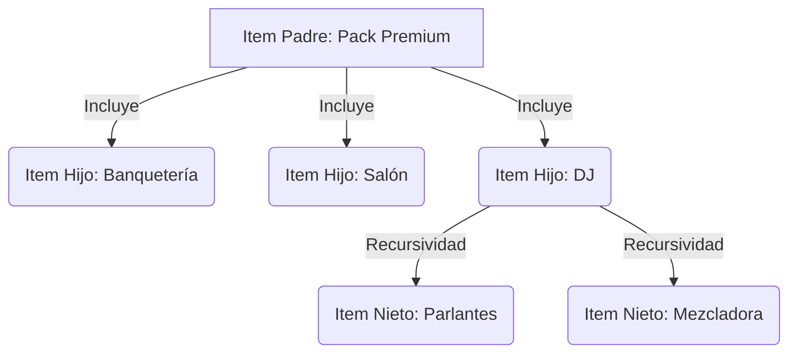

# Lógica de Composición y Kits: SF Lodge v2

**Versión:** 2.0
**Estado:** Definición Técnica
**Dependencia:** Requiere `DATA_DICTIONARY_v2.md`
**Propósito:** Definir cómo el sistema maneja ítems complejos (Packs, Menús, Kits) mediante una estructura recursiva simple.

---

## 1. Concepto General

La "Composición" permite vender un ítem comercial (ej: *"Pack Matrimonio Premium"*) que, internamente, se desglosa en múltiples ítems operativos (ej: *"Salón Principal"*, *"Banquetería Premium"*, *"DJ Básico"*).

Esto resuelve dos problemas:
1. **Simplicidad Comercial:** El cliente ve una sola línea en la cotización.
2. **Precisión Operativa:** El sistema sabe exactamente qué recursos se están comprometiendo.

### Diagrama de Jerarquía



## 2. Modelo de Datos (COMPOSICION)

Esta tabla actúa como una lista de ingredientes ("Receta"). Es Master Data (se carga en caché al inicio).

| Campo | Tipo | Descripción |
|-------|------|-------------|
| ID_Composicion | PK | Identificador único de la relación. |
| ID_Item_Padre | FK | El ítem que se vende (el "Pack"). |
| ID_Item_Hijo | FK | El componente interno. |
| Cantidad | Decimal | Multiplicador (ej: 1 Pack = 2 Parlantes). |
| Tipo_Precio | Enum | ABSORBIDO (El padre paga, hijo vale $0) o SUMAR (El padre suma el costo del hijo). |
| Es_Opcional | Bool | (Futuro) Si el usuario puede desmarcar este componente. |

## 3. Estrategias de Precios

El PricingEngine (Srv_Pricing.js) debe soportar dos estrategias fundamentales al encontrar un ítem compuesto.

### Estrategia A: "Precio Paquete" (Bundle)

**Caso de Uso:** "Menú de Matrimonio $50.000 p/p".

**Lógica:**
- El Padre tiene un precio definido en REGLA_PRECIO (ej: 50.000).
- Los Hijos están configurados como Tipo_Precio = ABSORBIDO.
- Resultado: El precio total es el del Padre. Los hijos se listan internamente para inventario, pero suman $0 a la cotización visible.

### Estrategia B: "Precio Dinámico" (Suma de Partes)

**Caso de Uso:** "Sistema de Audio a Medida".

**Lógica:**
- El Padre tiene un precio base de $0 (o una tarifa base de instalación).
- Los Hijos están configurados como Tipo_Precio = SUMAR.
- Resultado: El precio del Padre se calcula sumando: Precio_Base_Padre + (Precio_Hijo_1 * Cantidad) + (Precio_Hijo_2 * Cantidad)...

## 4. Algoritmo de Cálculo (Recursivo)

Para mantener el código simple, no usamos if/else anidados. Usamos recursividad. Esto permite que un Kit tenga dentro otro Kit infinitamente.

Pseudocódigo para Srv_Pricing.js:

```javascript
function calcularPrecio(item, contexto) {
    // 1. Obtener regla de precio del ítem
    let precio = obtenerPrecioBase(item, contexto);

    // 2. Buscar si tiene hijos en la tabla COMPOSICION
    let hijos = Repo_Composicion.obtenerHijos(item.ID);

    if (hijos.length > 0) {
        hijos.forEach(hijo => {
            // RECURSIVIDAD: Calcular precio del hijo usando esta misma función
            let precioUnitarioHijo = calcularPrecio(hijo.ItemDatos, contexto);

            if (hijo.Tipo_Precio === 'SUMAR') {
                precio += (precioUnitarioHijo * hijo.Cantidad);
            }
            // Si es 'ABSORBIDO', no sumamos nada (el precio base del padre ya lo cubre)
        });
    }

    return precio;
}
```

## 5. Ejemplos Prácticos

### Ejemplo 1: El "Pack Matrimonio" (Estrategia Absorbida)

**Item Padre:** SRV-PACK-MATRI (Precio Base: $80.000 por Pax)

**Componentes:**
- ALI-MENU-3T (Menú 3 Tiempos) -> ABSORBIDO (Precio $0)
- LOC-SALON-A (Salón Principal) -> ABSORBIDO (Precio $0)

**Cálculo:**
- Cotización por 100 pax.
- Precio = $80.000 * 100 = **$8.000.000**.
- (Internamente sabemos que necesitamos 100 menús y 1 salón).

### Ejemplo 2: El "Kit Técnica" (Estrategia Suma)

**Item Padre:** TEC-AUDIO-FULL (Precio Base: $50.000 - Honorario Técnico)

**Componentes:**
- EQP-PARLANTE ($20.000 c/u) -> SUMAR -> Cantidad: 4
- EQP-MEZCLA ($40.000 c/u) -> SUMAR -> Cantidad: 1

**Cálculo:**
- Base: $50.000
- Hijos: (4 * 20.000) + (1 * 40.000) = $120.000
- Total Item: $170.000.

## 6. Consideraciones de Implementación

- **Protección contra Ciclos:** El código debe validar que un ítem no sea hijo de sí mismo (A -> B -> A), lo que causaría un loop infinito y el error "Maximum call stack size exceeded".

- **Visualización en Cotización:** Por defecto, el cliente solo ve el Item Padre. Debe existir una opción ("Mostrar Desglose") en el Controller si queremos que el PDF liste los componentes hijos.

- **Cantidades:** La Cantidad en la tabla composición multiplica la cantidad del padre. Si vendo 2 "Kits de Audio" (Padre) y cada kit tiene 4 parlantes, el sistema descuenta 8 parlantes del inventario.
