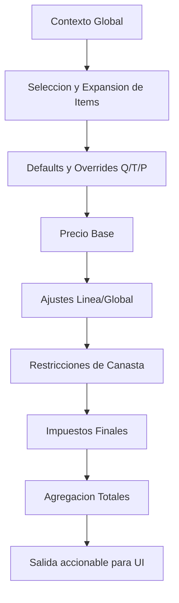

# Pipeline de Cálculo de Cotización v3.1 (Planning)

**Versión:** 3.1 (Planificación)  
**Estado:** Definición Técnica (Motor de Reglas Unificado por Etapas)  
**Objetivo:** Hacer explícito en qué etapa se ejecuta cada regla y cómo impacta UI, línea y total.

---

## 1. Contexto Global

Inputs base del evento:
- `Pax_Global`
- `Fecha_Evento`
- `Duracion_Dias`
- Cliente y metadatos de cotización

---

## 2. Selección y Expansión de Ítems

1. Usuario selecciona ítem.
2. Se valida inmediatamente `RESTRICCION_UI` (reglas accionables en UI).
3. Si es composición, se expande vía `COMPOSICION_KIT`.
4. Se genera una o más `LINEA_DETALLE` iniciales.

---

## 3. Resolución de Defaults y Overrides (Q/T/P)

Para cada línea se resuelven valores finales de entrada:

- `Input_Cantidad` (`Q`)
- `Input_Duracion_Min` (`T`)
- `Input_Pax` (`P`)

**Fuentes**: `CATEGORIA -> COMPOSICION -> ITEM -> USUARIO`  
**Precedencia efectiva**: `USUARIO > ITEM > COMPOSICION > CATEGORIA`

Reglas de etapa: `CANTIDAD_DEFAULT`.

---

## 4. Cálculo de Precio Base

Aplicar fórmula base por línea:

`Neto = Base + (P * Cp) + (T * Ct) + (Q * Cq)`

Reglas de etapa: `PRECIO_BASE`.

Aquí también se resuelven casos de tiempo especial (sobreturno, horarios, ventanas, etc.) si están modelados como reglas.

---

## 5. Ajustes (Descuentos / Sobrecargos)

Reglas de etapa:
- `AJUSTE_LINEA`
- `AJUSTE_GLOBAL`

Las reglas pueden:
- Modificar precio de línea.
- Insertar líneas de ajuste.
- Agregar automáticamente un ítem.

Estos resultados deben volver como salida accionable para UI.

---

## 6. Restricciones de Canasta

Reglas de etapa: `RESTRICCION_UI` / `RESTRICCION_FINAL`.

Pueden:
- Invalidar canasta (`ERROR`).
- Emitir advertencias (`WARNING`).
- Solicitar aprobación.

Se evalúan al seleccionar ítems y al recalcular antes de guardar.

---

## 7. Impuestos (Final)

Reglas de etapa: `IMPUESTO`.

Se aplican al final del cálculo sobre base neta consolidada y/o por línea.

Persistir en línea:
- `Impuesto_ID_Snapshot`
- `Impuesto_Tasa_Snapshot`
- `Impuesto_Monto`

---

## 8. Agregación de Totales

En encabezado (`COTIZACIONES`):
- `Total_Neto`
- `Total_Impuestos`
- `Total_Final`
- `Desglose_Impuestos`

---

## 9. Contrato de Salida para UI

Cada regla ejecutada puede generar eventos:
- `ERROR`
- `WARNING`
- `INFO`
- `APPLIED_ADJUSTMENT`
- `AUTO_ADDED_ITEM`

Formato sugerido:
- `ruleId`
- `stage`
- `target`
- `message`
- `delta`

---

## Diagrama de Etapas

---

## Referencias Activas
- `docs/db_docs_v3_1.md` (modelo objetivo unificado)
- `docs/db_docs_v3.md` (schema de transición actual)
- `src/Config/Config_Schema.js` (implementación actual)
- `docs/legacy/` (histórico v2)
