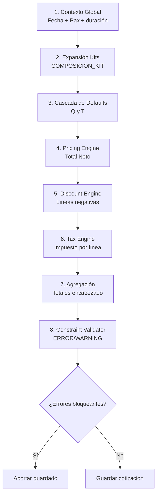
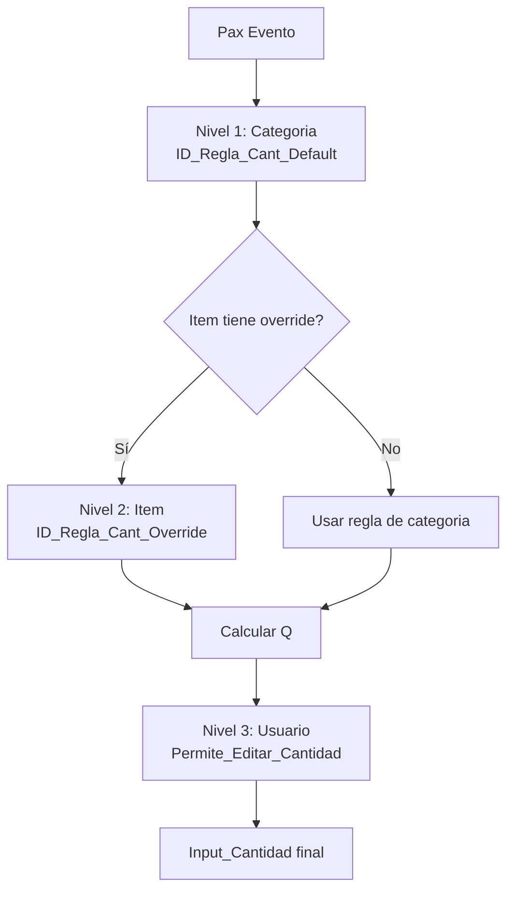

# Pipeline de Cálculo de Cotización v3.0

**Versión:** 3.0
**Estado:** Definición Técnica (Orquestación Controller/Servicio)
**Propósito:** Definir la secuencia completa de operaciones para recalcular una cotización con defaults en cascada, precios, descuentos, impuestos y validaciones.

---

## 1. Contexto Global (Inicialización)
Antes de procesar ítems, se construye el contexto base del evento.

**Input:**
- `Fecha_Evento` (inicio/fin)
- `Pax_Global` (usuario)

**Operaciones:**
- Calcular `Duracion_Dias`.
- Calcular `Es_Fin_De_Semana` (flag para reglas condicionales futuras).

---

## 2. Expansión de Kits (Composición)
Si se selecciona un pack/kit, se expande a líneas operativas.

**Input:**
- Lista de ítems seleccionados por el usuario.

**Operaciones:**
- Consultar `COMPOSICION_KIT`.
- Si es pack, traer hijos.
- Aplicar `Tipo_Precio`:
- `ABSORBIDO`: línea hija valorizada a 0.
- `SUMAR`: línea hija valorizada con su regla normal.

**Output:**
- Lista plana de líneas operativas.

---

## 3. Resolución de Cantidades y Tiempos (Cascada v3.0)
Para cada línea, resolver los valores de entrada al motor de precios.

### 3.1 Resolución de Cantidad (`Q`)
**Prioridad de herencia (3 capas):**
1. `ITEM_CATALOGO.ID_Regla_Cant_Override` + `Factor_Cant_Override`.
2. `CATEGORIAS.ID_Regla_Cant_Default` + `Factor_Cant_Default`.
3. Edición manual del usuario si `Permite_Editar_Cantidad = TRUE`.

**Ejecución de reglas (`REGLAS_CALCULO_CANTIDAD`):**
- `FIJO`: cantidad fija (normalmente `1` o valor base definido).
- `POR_PAX`: `Q = Pax`.
- `FACTOR_PAX`: `Q = Pax_Global * Factor`.
- `POR_TIEMPO`: `Q` en función de la duración (`T`).

### 3.2 Resolución de Tiempo (`T`)
**Prioridad recomendada:**
1. Override manual del usuario si `Permite_Editar_Duracion = TRUE`.
2. `ITEM_CATALOGO.Default_Duracion_Min`.
3. `CATEGORIAS.Def_Duracion_Min`.

**Persistencia:** guardar `T` final en `LINEA_DETALLE.Input_Duracion_Min`.

---

## 4. Cálculo de Precio Neto (Pricing Engine)
Con `P`, `T`, `Q` y la regla de precio resuelta, calcular valores netos.

**Resolución de regla de precio:**
1. `ITEM_CATALOGO.ID_Regla_Precio` (override de ítem).
2. `CATEGORIAS.ID_Regla_Precio_Default` (herencia de categoría).

**Regla base:**

`Total_Neto = Base + (P * Costo_Unitario_Pax) + (T * Costo_Unitario_Tiempo) + (Q * Costo_Unitario_Item)`

**Sobreturno (Tiered Pricing, opcional):**
Si `T > Tiempo_Base_Incluido`, aplicar:

`Extra = (T - Tiempo_Base_Incluido) * Costo_Unitario_Tiempo_Extra`

`Total_Neto = Total_Neto + Extra`

**Output por línea:**
- `Precio_Unitario_Calc`
- `Precio_Total_Linea` (neto)

---

## 5. Motor de Descuentos (Ajuste)
Aplicar reglas automáticas o manuales sobre el carrito valorizado.

**Input:**
- Líneas con precio neto.

**Operaciones:**
- Consultar `REGLAS_DESCUENTO`.
- Evaluar triggers.
- Calcular monto de descuento (`FIJO`, `POR_PAX`, `PORCENTAJE`).
- Insertar línea negativa en `LINEA_DETALLE` con:
- `Es_Descuento = true`
- `ID_Regla_Descuento` referenciado.

---

## 6. Cálculo de Impuestos (Tax Engine)
Calcular impuesto por línea y persistir snapshot.

**Prioridad de tasa:**
1. `ITEM_CATALOGO.ID_Impuesto`.
2. `CATEGORIAS.Def_Impuesto_ID`.

**Operación:**

`Impuesto_Monto = Precio_Total_Linea * Tasa`

**Persistencia en línea:**
- `Impuesto_Monto`
- `Impuesto_Tasa_Snapshot`

---

## 7. Agregación de Totales (Encabezado)
Consolidar resultados en `COTIZACIONES`.

**Operaciones:**
- `Total_Neto` = suma de `Precio_Total_Linea`.
- `Total_IVA` = suma de líneas con impuesto IVA.
- `Total_Impuestos_Adic` = suma de líneas con impuestos adicionales (ILA, otros).
- `Total_Final` = `Total_Neto + Total_IVA + Total_Impuestos_Adic`.
- `Desglose_Impuestos` = snapshot JSON por tipo de impuesto.

---

## 8. Validación Final (Constraint Validator)
Validación antes de guardar/finalizar.

**Input:**
- Cotización completa calculada.

**Operaciones:**
- Consultar `RESTRICCION`.
- Verificar mínimos (pax, venta).
- Verificar dependencias (`REQUIERE`).
- Verificar incompatibilidades (`EXCLUYE`).

**Output:**
- Lista de `ERROR` y `WARNING`.
- Si existen `ERROR`, abortar guardado.

---

## Orden Obligatorio del Pipeline
1. Contexto
2. Composición
3. Resolución de drivers (`Q`, `T`, `P`)
4. Precio neto
5. Descuentos
6. Impuestos
7. Totales
8. Validación

---

## Diagrama de Flujo (Operaciones)

---

## Diagrama de Triple Capa (Cantidad)

---

## Referencias
- `docs/db_docs_v3.md` (diccionario vigente v3)
- `src/Config/Config_Schema.js` (fuente de verdad actual para campos)
- `docs/legacy/` (documentación histórica v2/v2.4)
