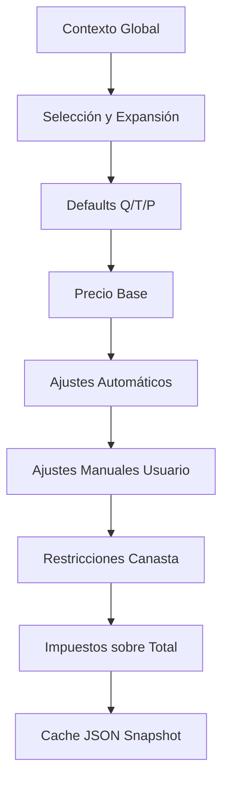

# Pipeline de Cálculo de Cotización v3.2 (Planning)

**Versión:** 3.2
**Fuente de verdad para tablas:** `src/Config/Config_Schema.js`

---

## 1. Contexto Global

Inputs desde `COTIZACIONES`:
- `Pax_Global`, `Fecha_Evento`, `Duracion_Dias`, `ID_Cliente`

Regla de ejecución:
- Cambios de canasta se aplican primero (last-write-wins sobre valores globales).

---

## 2. Selección y Expansión de Ítems

1. Usuario selecciona ítem.
2. Se validan reglas `RESTRICCION_UI`.
3. Si es composición, se expande vía `COMPOSICION_KIT`.
4. Se crea `LINEA_DETALLE` con inputs iniciales.
5. Si hay remoción de ítem, debe persistirse como evento/estado trazable (no borrar historial).

---

## 3. Resolución de Defaults (Q/T/P)

Para cada línea, resolver valores de entrada:

- **P (Pax):** `Override_Pax` → si vacío, `Pax_Global`
- **Q (Cantidad):** `Override_Cantidad` → si vacío, calcular desde `Def_Unidades_Por_Pax` (item override > categoría) × P
- **T (Duración):** `Override_Duracion_Min` → si vacío, `Categoría.Def_Duracion_Min`

Reglas de etapa `CANTIDAD_DEFAULT` pueden modificar estos valores.

---

## 4. Resolución de Precio Base

1. Resolver perfil: `ITEM.ID_Perfil_Precio_Override` → si vacío, `CATEGORIA.ID_Perfil_Precio_Default`.
2. Aplicar fórmula: `Neto = Base + (P * Cp) + (T * Ct) + (Q * Cq)`
3. Solo usa las dimensiones activas según categoría (`Requiere_Pax`, `Requiere_Cant`, `Requiere_Tiempo`).

---

## 5. Reglas de Ajuste

Etapas: `AJUSTE_LINEA`, `AJUSTE_GLOBAL`

- Modificar precio de línea.
- Insertar ajustes (sobreturno, recargos, descuentos automáticos).

---

## 6. Ajustes Manuales del Usuario

Aplicar `AJUSTES_COTIZACION`:
- Overrides de precio por línea o globales.
- Descuentos manuales, recargos.
- Se registra valor original vs valor nuevo.

---

## 7. Restricciones de Canasta

Etapa: `RESTRICCION_UI`

- `ERROR`: invalidar canasta.
- `WARNING`: advertir al usuario.
- Se evalúan al seleccionar ítems y antes de guardar.

---

## 8. Impuestos (sobre total)

Etapa: `IMPUESTO`

Se aplican al neto consolidado (suma de todas las líneas + ajustes). No por línea.

---

## 9. Agregación y Cache

1. Calcular neto, impuestos, total final.
2. Generar `CACHE_COTIZACION.Snapshot_JSON` con resultado completo.
3. El frontend consume el snapshot directamente.

---

## 10. Contrato de Salida para UI

Cada regla genera: `{ ruleId, stage, target, message, delta }`

Tipos: `ERROR`, `WARNING`, `INFO`, `APPLIED_ADJUSTMENT`, `AUTO_ADDED_ITEM`

---

## 11. Orden Canónico y Alcance de Recalc

El motor debe ejecutar siempre en este orden:

1. Estado de canasta global (`time`, `duration`, `pax`).
2. Resolución por ítem (orden estable):
   `ADD_ITEM` -> auto-add por composición/reglas -> defaults -> overrides de usuario.
3. Recalc parcial: si un override afecta una composición, recalcular solo ese subárbol.
4. Validación final de canasta completa.
5. Descuentos y ajustes globales al final.

Determinismo:
- Mismos inputs + mismo orden de eventos => mismo resultado.

---

## Diagrama de Etapas

---

## Referencias
- `src/Config/Config_Schema.js` (fuente de verdad)
- `docs/db_docs_v3_1.md` (modelo conceptual)
