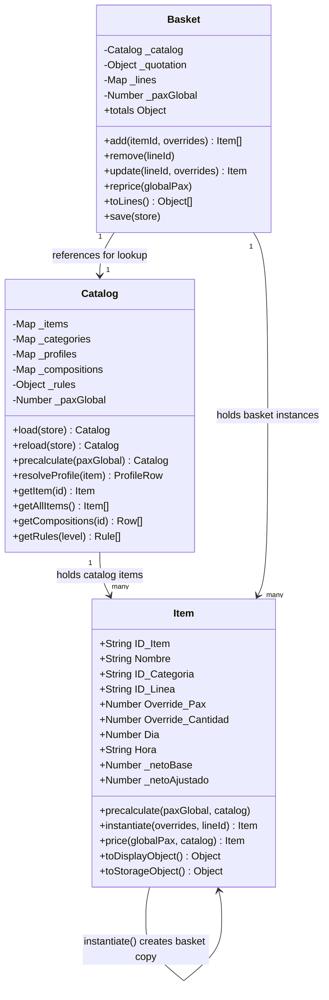
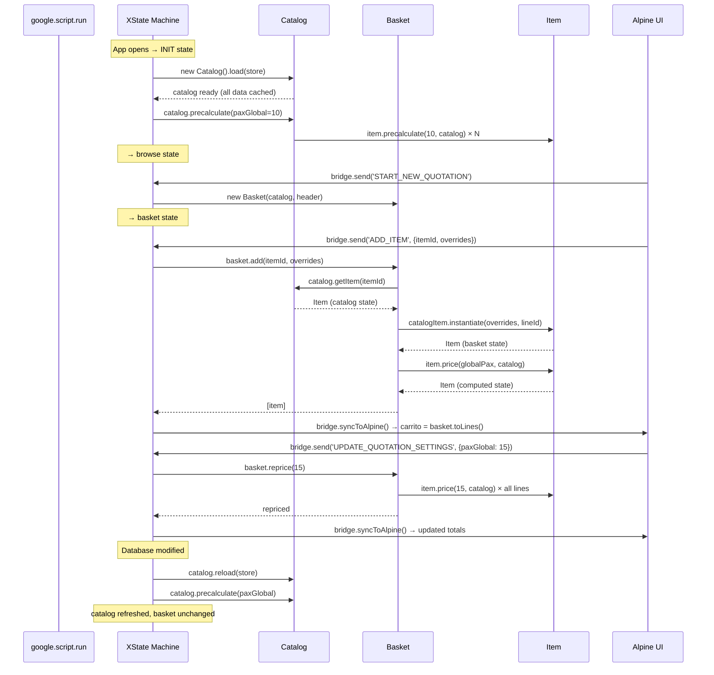
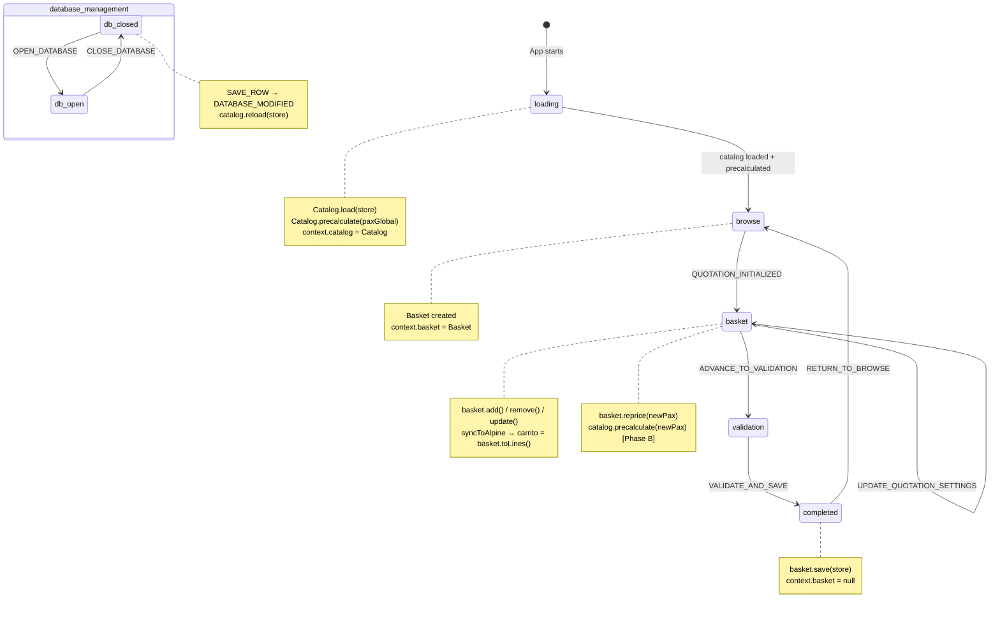

# Domain Model Design: Item, Catalog, Basket

## Why This Layer Exists

The current codebase has business logic in three places at once: XState actions call pricing
pipeline functions directly (~60 lines per action), Alpine manages `carrito[]` as local state
with fallback mutations, and the bridge does a complex transformation (`mapLineasToCarrito`)
because the underlying data shapes are inconsistent. There is no single object that says
"this is an item, here is everything it knows about itself."

The domain model introduces three classes that consolidate this:
- **`Catalog`** — the complete sellable offer (persistent, reloads only on DB change)
- **`Item`** — one item in any of its states (catalog preview → basket instance → priced)
- **`Basket`** — the current quotation's selected items + totals

---

## Class Descriptions

### `Item` — One Class, Three States

The key insight is that `ITEM_CATALOGO`, `LINEA_DETALLE`, and the runtime "expanded linea" are
all the same conceptual thing in different states. Unifying them into one class removes the
impedance mismatch between the catalog sidebar and the basket timeline.

```
State 1: catalog      { ID_Item, Nombre, ID_Categoria, _profile, _cachedPrice }
         ↓ item.instantiate(overrides, lineId)
State 2: basket       + { ID_Linea, Override_Pax, Override_Cantidad, Dia, Hora, Comentarios }
         ↓ item.price(globalPax, catalog)
State 3: computed     + { _pax, _cantidad, _netoBase, _netoAjustado, _ajustes, _lines[] }
```

Catalog items stay in State 1 (pre-calculated for display). Basket items live in State 2/3.

```javascript
// --- PROTOCODE: Item.js ---

class Item {

  // ── Construction ─────────────────────────────────────────────
  constructor(rawRow) {
    // From ITEM_CATALOGO row
    this.ID_Item       = rawRow.ID_Item
    this.Nombre        = rawRow.Nombre
    this.ID_Categoria  = rawRow.ID_Categoria
    this._profileId    = rawRow.ID_Perfil_Precio_Override  // null = inherit from category
    this.Activo        = rawRow.Activo ?? true

    // Basket state (null in catalog state)
    this.ID_Linea            = null
    this.Override_Pax        = null   // null = use globalPax
    this.Override_Cantidad   = null
    this.Override_Duracion_Min = null
    this.Dia                 = null
    this.Hora                = null
    this.Comentarios         = null

    // Computed state (populated by price())
    this._pax          = null
    this._netoBase     = null
    this._netoAjustado = null
    this._ajustes      = []
    this._lines        = []   // expanded child items (for kits)

    // Catalog pre-calculation cache
    this._cachedPrice  = null
    this._cachedPax    = null
  }

  // ── Identity ─────────────────────────────────────────────────
  get id()       { return this.ID_Item }
  get name()     { return this.Nombre }
  get isKit()    { return this._isKit }   // set by Catalog on load
  get inBasket() { return this.ID_Linea !== null }

  // ── Catalog state: pre-calculated display price ───────────────
  // Called by Catalog.precalculate(paxGlobal).
  // Phase A: naive (profile.Costo_Unitario_Pax × pax + Costo_Base_Fijo)
  // Phase B: full pipeline with item-level rules
  precalculate(paxGlobal, catalog) {
    const profile = catalog.resolveProfile(this)
    if (!profile) { this._cachedPrice = 0; return this }

    // Phase A — naive calculation
    const precio = profile.Costo_Base_Fijo + (profile.Costo_Unitario_Pax * paxGlobal)
    this._cachedPrice = precio
    this._cachedPax   = paxGlobal
    return this
  }

  get displayPrice() { return this._cachedPrice ?? 0 }

  // ── Basket state: create instance from catalog item ───────────
  // Returns a NEW Item so catalog item is never mutated.
  instantiate(overrides = {}, lineId) {
    const instance = new Item({ ...this })   // copy all base fields
    instance.ID_Linea              = lineId
    instance.Override_Pax          = overrides.Override_Pax        ?? null
    instance.Override_Cantidad     = overrides.Override_Cantidad    ?? null
    instance.Override_Duracion_Min = overrides.Override_Duracion_Min ?? null
    instance.Dia                   = overrides.Dia                  ?? 1
    instance.Hora                  = overrides.Hora                 ?? '09:00'
    instance.Comentarios           = overrides.Comentarios          ?? ''
    instance._cachedPrice          = this._cachedPrice   // inherit catalog preview
    return instance
  }

  // ── Computed state: price this basket item ────────────────────
  // Phase A: naive (same formula as precalculate, with effective pax)
  // Phase B: expand → resolveDefaults → pricing → item rules
  price(globalPax, catalog) {
    const effectivePax = this.Override_Pax ?? globalPax
    const profile = catalog.resolveProfile(this)
    if (!profile) { this._netoBase = 0; this._netoAjustado = 0; return this }

    this._pax          = effectivePax
    this._netoBase     = profile.Costo_Base_Fijo + (profile.Costo_Unitario_Pax * effectivePax)
    this._netoAjustado = this._netoBase   // Phase A: no rule adjustment
    this._ajustes      = []               // Phase B: item-level rule results
    return this
  }

  get effectivePax() { return this.Override_Pax ?? this._pax }
  get total()        { return this._netoAjustado ?? this._cachedPrice ?? 0 }
  get unitPrice()    { return this._pax > 0 ? Math.round(this.total / this._pax) : this.total }

  // ── Serialization ─────────────────────────────────────────────
  toDisplayObject() {
    return {
      id:          this.ID_Linea || this.ID_Item,
      lineId:      this.ID_Linea,
      itemId:      this.ID_Item,
      nombre:      this.Nombre,
      dia:         this.Dia,
      hora:        this.Hora,
      comentarios: this.Comentarios,
      cantidad:    this.effectivePax,
      precio:      this.unitPrice,
      total:       this.total,
      Override_Pax: this.Override_Pax,
      _raw:        this,   // bridge can access full item if needed
    }
  }

  toStorageObject() {
    return {
      ID_Linea:              this.ID_Linea,
      ID_Item:               this.ID_Item,
      Override_Pax:          this.Override_Pax,
      Override_Cantidad:     this.Override_Cantidad,
      Override_Duracion_Min: this.Override_Duracion_Min,
      Dia:                   this.Dia,
      Hora:                  this.Hora,
      Comentarios:           this.Comentarios,
    }
  }
}
```

---

### `Catalog` — Persistent, Pre-Calculated

```javascript
// --- PROTOCODE: Catalog.js ---

class Catalog {

  constructor() {
    this._items        = new Map()   // ID_Item → Item
    this._categories   = new Map()   // ID_Categoria → raw row
    this._profiles     = new Map()   // ID_Perfil_Precio → raw row
    this._compositions = new Map()   // ID_Item_Padre → child rows[]
    this._rules        = { item: [], restriction: [], global: [], tax: [] }
    this._paxGlobal    = null
    this._loaded       = false
  }

  // ── Loading ───────────────────────────────────────────────────
  // Called once at INIT. Reads all reference data eagerly.
  // After this, catalog is self-contained — no more store reads.
  load(store) {
    // Items
    for (const row of store.all('ITEM_CATALOGO')) {
      this._items.set(row.ID_Item, new Item(row))
    }

    // Categories + profiles
    for (const row of store.all('CATEGORIAS'))      this._categories.set(row.ID_Categoria, row)
    for (const row of store.all('PERFILES_PRECIO')) this._profiles.set(row.ID_Perfil_Precio, row)

    // Compositions — grouped by parent
    for (const row of store.all('COMPOSICION_KIT')) {
      if (!this._compositions.has(row.ID_Item_Padre)) {
        this._compositions.set(row.ID_Item_Padre, [])
      }
      this._compositions.get(row.ID_Item_Padre).push(row)
    }

    // Mark kit items
    for (const [parentId] of this._compositions) {
      const item = this._items.get(parentId)
      if (item) item._isKit = true
    }

    // Rules — partitioned by level (ready for Phase B)
    const allRules = store.all('REGLAS_NEGOCIO')
    this._rules.item        = allRules.filter(r => r.Etapa === 'AJUSTE_LINEA')
    this._rules.restriction = allRules.filter(r => r.Etapa === 'RESTRICCION_UI')
    this._rules.global      = allRules.filter(r => r.Etapa === 'AJUSTE_GLOBAL')
    this._rules.tax         = allRules.filter(r => r.Etapa === 'IMPUESTO')
    // Phase B: composition rules

    this._loaded = true
    return this
  }

  // Called after DATABASE_MODIFIED event (not on every quotation start)
  reload(store) {
    this._items.clear()
    this._categories.clear()
    this._profiles.clear()
    this._compositions.clear()
    return this.load(store).precalculate(this._paxGlobal)
  }

  // ── Pre-calculation ───────────────────────────────────────────
  // Computes displayPrice on every item at this paxGlobal.
  // Called after load() and when paxGlobal changes.
  precalculate(paxGlobal) {
    this._paxGlobal = paxGlobal
    for (const item of this._items.values()) {
      item.precalculate(paxGlobal, this)
    }
    return this
  }

  // ── Profile resolution ────────────────────────────────────────
  // Item may override profile; category may override profile; fall back to null.
  resolveProfile(item) {
    const profileId = item._profileId
      || (this._categories.get(item.ID_Categoria) || {}).ID_Perfil_Precio_Default
    return this._profiles.get(profileId) || null
  }

  // ── Access ────────────────────────────────────────────────────
  getItem(id)           { return this._items.get(id) || null }
  getAllItems()          { return [...this._items.values()] }
  getCompositions(id)   { return this._compositions.get(id) || [] }
  getRules(level)       { return this._rules[level] || [] }
  get paxGlobal()       { return this._paxGlobal }

  getItemsByCategory() {
    const groups = new Map()
    for (const item of this._items.values()) {
      const cat = (this._categories.get(item.ID_Categoria) || {}).Nombre || item.ID_Categoria
      if (!groups.has(cat)) groups.set(cat, [])
      groups.get(cat).push(item)
    }
    return groups
  }
}
```

---

### `Basket` — Per-Quotation

```javascript
// --- PROTOCODE: Basket.js ---

class Basket {

  constructor(catalog, quotationHeader) {
    this._catalog    = catalog
    this._quotation  = quotationHeader   // { ID_Cotizacion, ID_Cliente, Fecha_Evento, Duracion_Dias }
    this._lines      = new Map()         // ID_Linea → Item (basket state)
    this._seq        = 0
    this._paxGlobal  = catalog.paxGlobal
  }

  _nextLineId() { return `LIN_${String(++this._seq).padStart(4, '0')}` }

  // ── Mutations ─────────────────────────────────────────────────

  // Phase A: single item, no kit expansion
  // Phase B: expand compositions, create multiple Items for kits
  add(itemId, overrides = {}) {
    const catalogItem = this._catalog.getItem(itemId)
    if (!catalogItem) throw new Error(`Item not found: ${itemId}`)

    const lineId   = this._nextLineId()
    const instance = catalogItem.instantiate(overrides, lineId)
    instance.price(this._paxGlobal, this._catalog)

    this._lines.set(lineId, instance)
    return [instance]   // array: Phase B will return multiple for kits
  }

  remove(lineId) {
    this._lines.delete(lineId)
  }

  update(lineId, overrides = {}) {
    const item = this._lines.get(lineId)
    if (!item) return null

    if (overrides.Override_Pax        !== undefined) item.Override_Pax        = overrides.Override_Pax
    if (overrides.Override_Cantidad   !== undefined) item.Override_Cantidad   = overrides.Override_Cantidad
    if (overrides.Override_Duracion_Min !== undefined) item.Override_Duracion_Min = overrides.Override_Duracion_Min
    if (overrides.Hora                !== undefined) item.Hora                = overrides.Hora
    if (overrides.Dia                 !== undefined) item.Dia                 = overrides.Dia
    if (overrides.Comentarios         !== undefined) item.Comentarios         = overrides.Comentarios

    item.price(this._paxGlobal, this._catalog)
    return item
  }

  // ── Reprice ───────────────────────────────────────────────────
  // Called when paxGlobal changes.
  // Phase A: reprices all items (no "ask user" dialog yet).
  // Phase B: separates lines with/without Override_Pax, prompts user for overrides.
  reprice(globalPax) {
    this._paxGlobal = globalPax
    for (const item of this._lines.values()) {
      item.price(globalPax, this._catalog)
    }
  }

  // ── Totals ────────────────────────────────────────────────────
  // Phase A: simple sum
  // Phase B: + AJUSTE_GLOBAL rules + IMPUESTO rules
  get totals() {
    const subtotal = [...this._lines.values()]
      .reduce((sum, item) => sum + item.total, 0)
    // Phase B: apply basket-level rules here
    return { subtotal, taxes: [], total: subtotal }
  }

  // ── Output ────────────────────────────────────────────────────
  toLines() {
    return [...this._lines.values()]
      .sort((a, b) => (a.Dia - b.Dia) || a.Hora.localeCompare(b.Hora))
      .map(item => item.toDisplayObject())
  }

  toSnapshot() {
    return {
      cotizacion:  { ...this._quotation },
      lineas:      [...this._lines.values()].map(i => i.toStorageObject()),
      totals:      this.totals,
    }
  }

  save(store) {
    store.insert('COTIZACIONES', { ...this._quotation, Estado: 'Guardada' })
    for (const item of this._lines.values()) {
      store.insert('LINEA_DETALLE', { ...item.toStorageObject(), ID_Cotizacion: this._quotation.ID_Cotizacion })
    }
    store.insert('CACHE_COTIZACION', {
      ID_Cotizacion: this._quotation.ID_Cotizacion,
      Snapshot_JSON: JSON.stringify(this.toSnapshot()),
      Updated_At:    new Date().toISOString(),
    })
  }
}
```

---

## Rule Application Logic (Three Levels)

Rules are partitioned by `Etapa` into three levels. Each level has a different evaluation
context and fires at a different stage.

```
ADD_ITEM event
  │
  ├─ Phase A: Catalog.resolveProfile(item) → naive price × pax
  │
  └─ Phase B: Full pipeline per item:
       ├─ [1] expand compositions (if kit → multiple Items)
       ├─ [2] CANTIDAD_DEFAULT rules → set default _pax, _cantidad, _duracion
       ├─ [3] pricing profile → _netoBase
       └─ [4] ITEM RULES (per item):
               ├─ RESTRICCION_UI  → validation errors (block if failing)
               └─ AJUSTE_LINEA    → price adjustments (discounts, surcharges)
                    eval context: single item + its overrides

VALIDATE_AND_SAVE event
  │
  └─ Phase B: Basket-level rules after all items priced:
       ├─ AJUSTE_GLOBAL  → basket-level adjustments
       │    eval context: { subtotal, lineas[] }
       └─ IMPUESTO       → taxes on final subtotal
            eval context: { subtotal }
```

Note: `Acumulable = false` on a rule stops further rule application for that item
(used for mutually exclusive discounts).

---

## Mermaid Diagrams

### Class Relationships



### Lifecycle Sequence



### State Machine Context Flow



---

## Micro-State-Machine Concept (Experimental Direction)

The idea: each item in the basket timeline is its own isolated Alpine component with its own
state, rather than being a "dumb row" rendered from a parent `x-for`.

### Current model (one giant component):
```
cotizadorApp()
  └─ carrito[]
       └─ template x-for → dumb rows, all state in parent
```

### Proposed model (islands):
```
cotizadorApp()
  └─ basket.toLines()
       └─ template x-for
            └─ x-data="itemComponent(item.lineId)"
                 ├─ own: { expanded, editing, saving, error }
                 ├─ own: computed price display
                 └─ sends: bridge.send('UPDATE_ITEM', ...) on change
```

### What `itemComponent(lineId)` would look like:

```javascript
function itemComponent(lineId) {
  return {
    lineId,
    expanded: false,
    editing: false,

    // Read from parent bridge (via Alpine.store or window ref)
    get item() {
      return Alpine.store('cotizadorApp').carrito.find(i => i.lineId === this.lineId)
    },

    // Item-level actions — each item talks to bridge directly
    updatePax(val) {
      window.cotizadorBridge.send('UPDATE_ITEM', {
        lineId: this.lineId,
        overrides: { Override_Pax: parseInt(val) }
      })
    },

    remove() {
      window.cotizadorBridge.send('REMOVE_ITEM', { lineId: this.lineId })
    },

    copyToNextDay() {
      window.cotizadorBridge.send('ADD_ITEM', {
        itemId: this.item?.itemId,
        overrides: { Dia: (this.item?.dia || 1) + 1, Override_Pax: this.item?.Override_Pax }
      })
    },
  }
}
```

### Why this matters for architecture:
- **Isolation**: changing one item's pax doesn't re-render all items
- **Local state**: expand/collapse is truly local, not in the basket
- **XState per item?**: If each item needs complex state (editing → validating → saving → saved),
  a spawned XState actor per item becomes natural. The parent machine manages the basket; each
  item actor manages its own lifecycle.

```
QuotationMachine (parent)
  ├─ context.basket: Basket
  └─ spawned actors:
       ├─ ItemActor("LIN_0001") → editing | saving | saved | error
       ├─ ItemActor("LIN_0002") → idle | expanded
       └─ ItemActor("LIN_0003") → idle
```

This is especially useful if items need async operations (e.g., availability check, real-time
pricing from a slow GAS call). Each item actor can be loading/ready/error independently.

**Decision needed before implementing:**
- Do basket items need async per-item operations?
- Is the Alpine `x-data` isolation sufficient, or is a full XState actor per item needed?
- How do item actors communicate back to the parent basket machine?

---

## Open Design Decisions

| Decision | Options | Notes |
|----------|---------|-------|
| Kit expansion in `Basket.add()` | (a) expand to multiple Items, (b) one Item with children[] | Current pipeline uses (a) |
| paxGlobal change on lines with overrides | Ask user / auto-clear / keep | Phase B |
| Item micro-state-machine backend | Alpine-only / XState spawned actor | Experiment needed |
| Rule application in `Item.price()` | Use existing pipeline functions | Phase B, no new code |
| Basket totals with rules | Use existing `aggregateBasketTotals` | Phase B, delegate to pipeline |
