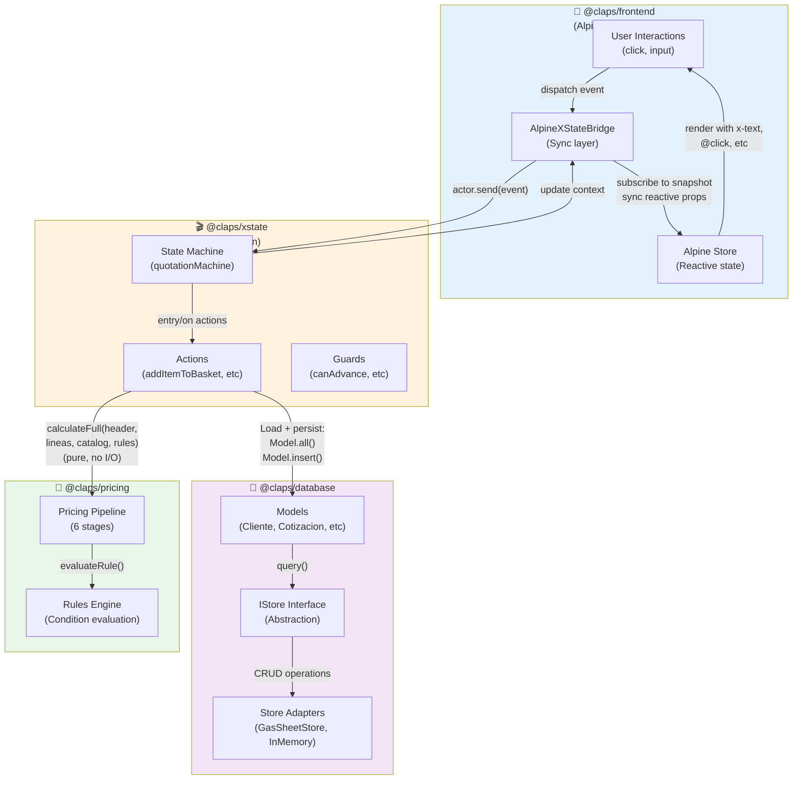
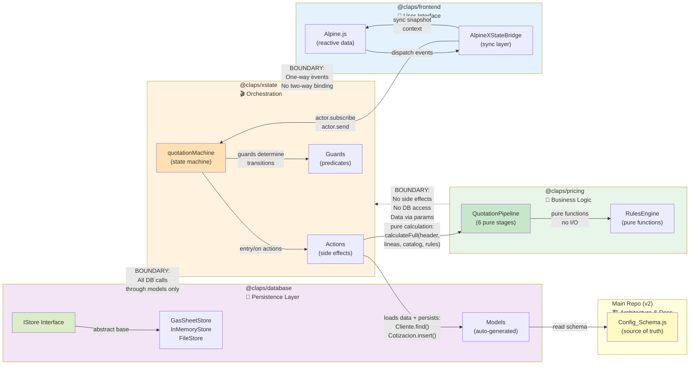
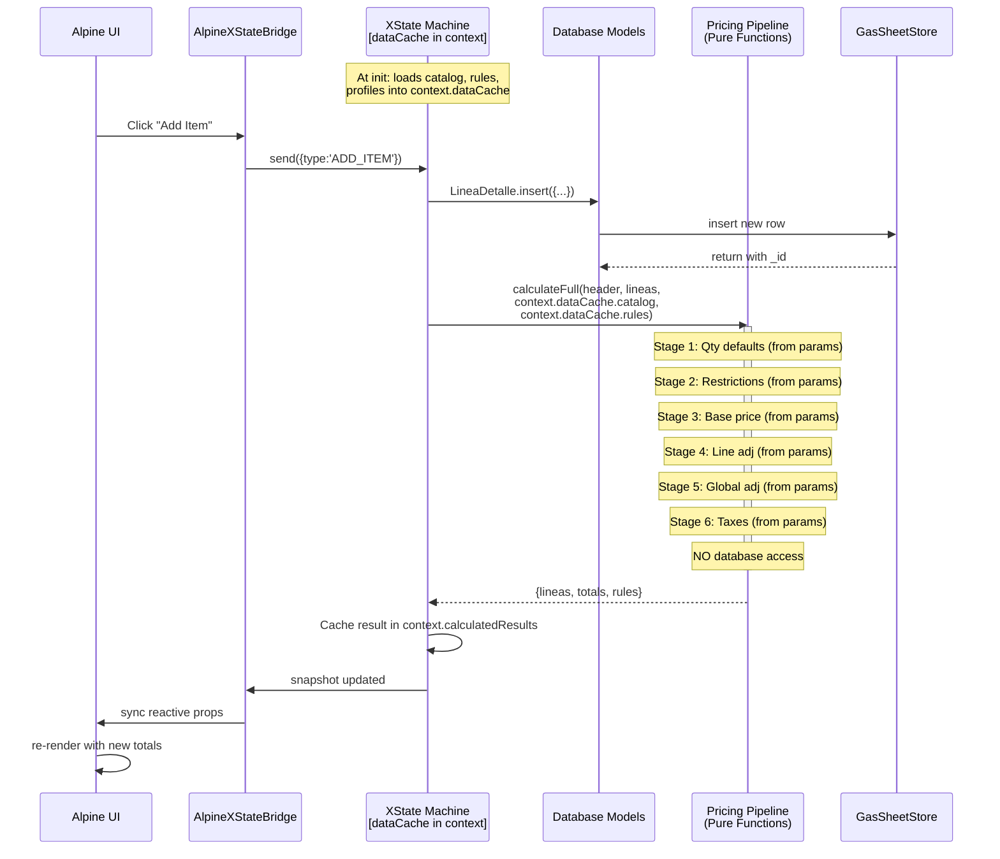
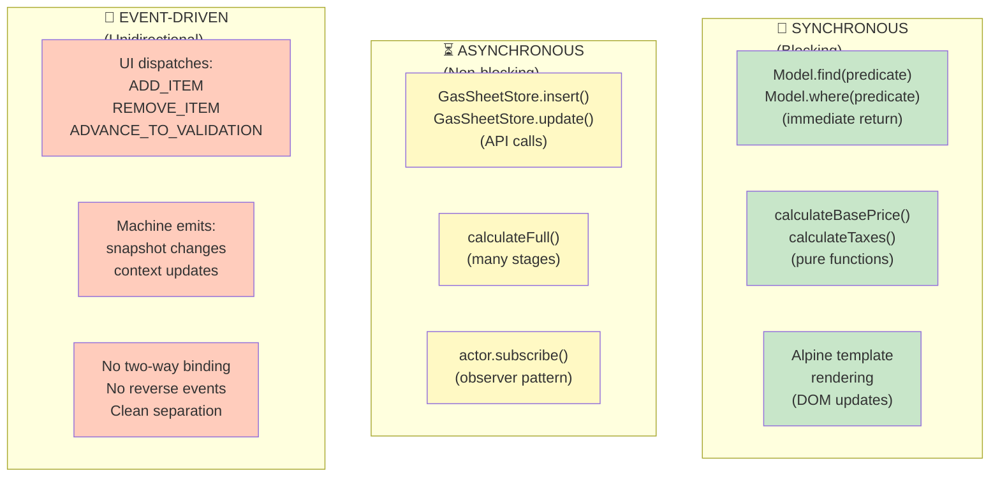
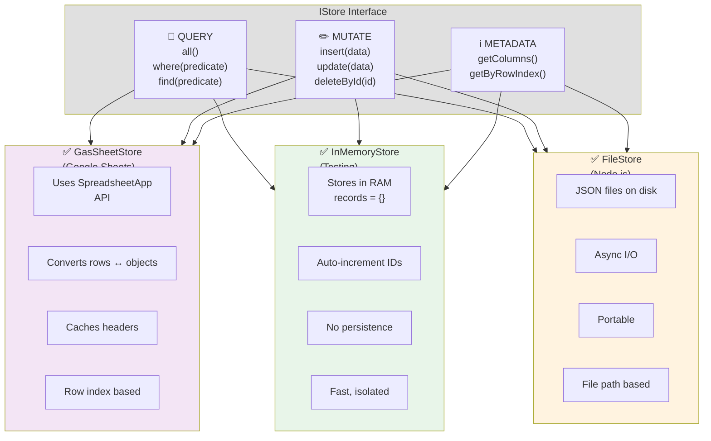
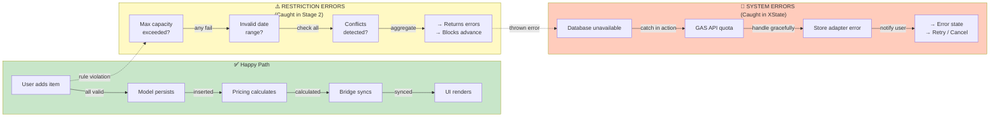
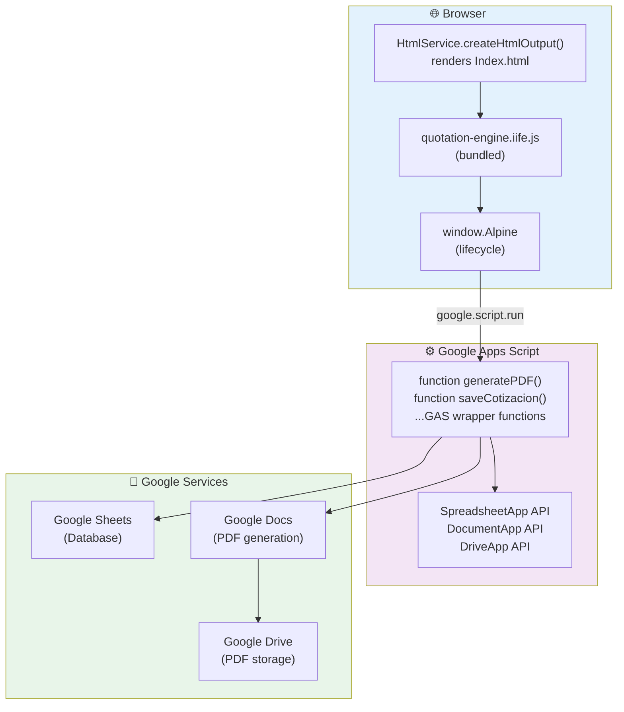

# Worktrees Architecture Guide

**Version:** 1.0
**Date:** 2026-02-18
**Status:** Architectural Reference

---

## Overview: The 5-Worktree Ecosystem

The Cotizador Lodge system is built as a **coordinated multi-worktree monorepo** where each worktree specializes in a distinct concern:

```
┌─────────────────────────────────────────────────────────────────────┐
│                     FINAL PRODUCT: GAS App                          │
│           (Bundled IIFE loaded into Google Sheets UI)               │
└─────────────────────────────────────────────────────────────────────┘
                                    ↑
                     (npm run build → Rollup)
                                    ↓
┌──────────────────────┬───────────────────────┬──────────────────────┐
│  @claps/database     │   @claps/xstate       │  @claps/frontend     │
│  (Persistence)       │   (Orchestration)     │  (User Interface)    │
│                      │                       │                      │
│  ✅ Models           │  ✅ State Machine     │  ✅ Alpine.js        │
│  ✅ Stores           │  ✅ Actions/Guards    │  ✅ Components       │
│  ✅ Config           │  ✅ Service Layer     │  ✅ Bridge           │
└──────────────────────┴───────────────────────┴──────────────────────┘
                                    ↑
                      (Parameter-based input from XState)
                                    ↓
┌──────────────────────────────────────────────────────────────────────┐
│                    @claps/pricing                                    │
│              (Business Logic: 100% Pure Calculations)               │
│                                                                      │
│  ✅ expand() - Pack/bundle expansion                                │
│  ✅ defaults() - Q/T/P resolution                                   │
│  ✅ pricing() - Base price formula                                  │
│  ✅ adjustments() - Rule-driven discounts                           │
│  ✅ taxes() - IVA calculation                                       │
│  ✅ pipeline() - Orchestration (all data as params)                 │
└──────────────────────────────────────────────────────────────────────┘
                                    ↑
                      (Standalone, zero dependencies, zero I/O)
                                    ↓
┌──────────────────────────────────────────────────────────────────────┐
│                     claps_codelab (v2 branch)                        │
│                  (Architecture & Planning Docs)                      │
│                                                                      │
│  ✅ Changelog                                                        │
│  ✅ Design decisions                                                 │
│  ✅ README.md                                                        │
│  ✅ Database schema reference                                        │
└──────────────────────────────────────────────────────────────────────┘
```

---

## Module Interactions: Mermaid Diagrams

### Diagram 1: Runtime Architecture & Data Flow



---

### Diagram 2: Module Boundaries & Dependencies



---

### Diagram 3: Data Flow During Quotation Calculation



---

### Diagram 4: Communication Patterns



---

### Diagram 5: Store Adapter Contract



---

### Diagram 6: Error Boundaries & Failure Modes



---

### Diagram 7: Stage-by-Stage Pricing Pipeline

```mermaid
graph LR
    Input["📥 INPUT<br/>Header + Lineas<br/>+ Catalog<br/>+ Rules"]

    Stage1["STAGE 1<br/>CANTIDAD_DEFAULT<br/>---<br/>Resolve quantity<br/>from overrides<br/>or defaults"]

    Stage2["STAGE 2<br/>RESTRICCION_UI<br/>---<br/>Check business<br/>rules violations<br/>❌ if error"]

    Stage3["STAGE 3<br/>PRECIO_BASE<br/>---<br/>Formula:<br/>Base +<br/>P×Cp + T×Ct +<br/>Q×Cq"]

    Stage4["STAGE 4<br/>AJUSTE_LINEA<br/>---<br/>Apply line-level<br/>discounts/<br/>surcharges"]

    Stage5["STAGE 5<br/>AJUSTE_GLOBAL<br/>---<br/>Apply basket<br/>adjustments"]

    Stage6["STAGE 6<br/>IMPUESTO<br/>---<br/>Calculate IVA<br/>or custom tax"]

    Output["📤 OUTPUT<br/>Cached snapshot:<br/>Lineas + Totals<br/>+ Applied rules"]

    Input -->|for each line| Stage1
    Stage1 -->|validate| Stage2
    Stage2 -->|✅ continue| Stage3
    Stage3 -->|apply rules| Stage4
    Stage4 -->|basket-wide| Stage5
    Stage5 -->|tax rate| Stage6
    Stage6 -->|cache| Output

    style Input fill:#bbdefb
    style Stage1 fill:#e1bee7
    style Stage2 fill:#ffccbc
    style Stage3 fill:#c8e6c9
    style Stage4 fill:#fff9c4
    style Stage5 fill:#b3e5fc
    style Stage6 fill:#f0f4c3
    style Output fill:#dcedc8
```



---

### Diagram 8: Deployment Architecture (GAS)



---

## The Quotation Story: How It All Works Together

### Use Case: A Client Creates and Saves a Quotation

**"I'm organizing a 3-day corporate retreat for 50 people. I need a quotation with accommodations, meals, and activities."**

#### Step 1: Frontend - Client Opens Cotizador App

```
🎬 User opens Index.html in Google Sheets
   ↓
   Alpine.js initializes Stores_App.html
   ↓
   AlpineXStateBridge creates connection to XState actor
   ↓
   State machine enters 'browse' state
```

**Worktree involved:** `@claps/frontend`
**What happens:** UI displays client search, previous quotations list, etc.

---

#### Step 2: Database - Load Previous Client Data

```
User searches for client "ACME Corp" (RUT: 12345678-9)
   ↓
Frontend dispatches event: { type: 'SEARCH_CLIENT', query: 'ACME' }
   ↓
XState action: listPreviousQuotations()
   ↓
   Calls: Cliente.search('ACME')
      ↓
      @claps/database → ModelFactory.createModel('CLIENTES')
      ↓
      Store adapter (GasSheetStore) queries Google Sheets
      ↓
      Returns: [{ ID_Cliente: 'CLI-001', Nombre_Empresa: 'ACME Corp', ... }]
```

**Worktrees involved:**
- `@claps/frontend` - Dispatches event
- `@claps/xstate` - Handles action
- `@claps/database` - Retrieves client record

---

#### Step 3: Initialize New Quotation

```
User clicks "New Quotation" for ACME Corp + 50 pax + June 15, 2026
   ↓
Frontend dispatches: {
  type: 'INITIALIZE_QUOTATION',
  clientId: 'CLI-001',
  paxGlobal: 50,
  fechaEvento: '2026-06-15'
}
   ↓
XState action: initializeEmptyBasket()
   ↓
   Calls: Cotizacion.create({
     ID_Cliente: 'CLI-001',
     Pax_Global: 50,
     Fecha_Evento: '2026-06-15',
     Duracion_Dias: 3
   })
   ↓
   @claps/database → Cotizacion model inserts record
   ↓
   State machine transitions to 'quotation.basket'
```

**Result:** Empty quotation exists in database
**State:** `quotation.basket` (user can now add items)

---

#### Step 4: User Adds Items (Iterative)

```
User selects:
  - Day 1: "Chinook Salon 4h" (50 pax)
  - Day 1: "Dinner Buffet" (50 pax)
  - Day 2: "Horseback Riding 2h" (30 pax, override)
  - Day 3: "Team Building Activity" (50 pax)
   ↓
For EACH item selection:
  Frontend dispatches: {
    type: 'ADD_ITEM',
    itemId: 'CHINOOK',
    dia: 1,
    paxOverride: null (uses global 50)
  }
   ↓
   XState action: addItemToBasket()
   ↓
   Calls: LineaDetalle.insert({
     ID_Cotizacion: 'COT-0001',
     ID_Item: 'CHINOOK',
     Dia_Numero: 1,
     Override_Pax: null
   })
   ↓
   @claps/database → LineaDetalle model stores input line
   ↓
   XState action: fullRecalculate()
   ↓
   [DETAILED PRICING FLOW - SEE BELOW]
   ↓
   State machine updates context with calculated prices
   ↓
   AlpineXStateBridge syncs to reactive properties
   ↓
   Frontend re-renders basket with new totals
```

**Worktrees involved:**
- `@claps/frontend` - User clicks item
- `@claps/xstate` - Orchestrates flow
- `@claps/database` - Persists line item
- `@claps/pricing` - Calculates prices (next step)

---

#### Step 5: Pricing Calculation (The Core Business Logic)

This is where `@claps/pricing` comes in:

```
XState calls: pipeline.calculateFull(header, lineas, catalog, rules)
   ↓
All data passed as parameters from XState context (no database access by pricing):
  1. header: { Pax_Global=50, Duracion_Dias=3 }      (from context.quotation)
  2. lineas: All line items                            (from context.lineas)
  3. catalog: { items, categories, profiles }          (from context.dataCache, loaded at init)
  4. rules: All business rules                         (from context.dataCache, loaded at init)

   ↓
STAGE 1: CANTIDAD_DEFAULT
  For each line item:
    - Check CATEGORIAS.Def_Requiere_Cantidad
    - Check rules with Etapa='CANTIDAD_DEFAULT'
    - Set sensible defaults (e.g., 1 item, or calculated from pax)
    Result: Each line has quantity (Q)

   ↓
STAGE 2: RESTRICCION_UI
  Check if selections are valid:
    - Max capacity per room?
    - Conflicting services?
    - Minimum pax requirements?
    If invalid, set ERROR state (blocks user from advancing)

   ↓
STAGE 3: PRECIO_BASE
  For each line, calculate: Neto = Base + (P × Cp) + (T × Ct) + (Q × Cq)
    where:
      P = Pax (from Pax_Global or Override_Pax)
      T = Time (minutes from Hora_Inicio, Duracion_Min)
      Q = Quantity (from calculador or Override_Cantidad)
      Cp, Ct, Cq = Unit costs from PERFILES_PRECIO

   ↓
STAGE 4: AJUSTE_LINEA
  Apply rules with Etapa='AJUSTE_LINEA':
    - "Early Bird Discount" → MULTIPLY by 0.9 if date > 60 days out
    - "Volume Discount" → ADD_FIXED of -5000 if total > 1M
    - "Complementary Activity" → ADD_ITEM automatically
    Result: Each line has adjusted price

   ↓
STAGE 5: AJUSTE_GLOBAL
  Apply rules with Etapa='AJUSTE_GLOBAL' (across entire quotation):
    - "Corp Client Loyalty" → Apply 10% discount to basket total if client has > 5 quotations
    - "High Value Deal" → If total > 5M, add gift voucher

   ↓
STAGE 6: IMPUESTO
  Apply tax rules with Etapa='IMPUESTO':
    - Standard: IVA 19% on subtotal
    - Or custom rule: "No Tax on Services" → SET_TAX to 0
    Result: Final total = Neto + IVA

   ↓
CACHE: Store entire calculated result as JSON snapshot
   ↓
Return to XState:
   {
     lineas: [
       {
         ID_Item: 'CHINOOK',
         Dia: 1,
         Pax: 50,
         Cantidad: 1,
         Duracion_Min: 240,
         Precio_Unitario: 2500,
         Total_Linea: 2500,
         Reglas_Aplicadas: ['REGLA-001', 'REGLA-003'],
         ...
       },
       ...
     ],
     totals: {
       subtotal: 125000,
       descuentos: -12500,
       subtotal_neto: 112500,
       iva: 21375,
       total: 133875
     }
   }
```

**Worktree involved:** `@claps/pricing` (100% of calculation logic)

**Key principle:** Pricing is **pure functions** - no side effects, no database writes.
All calculation logic is deterministic and testable independently.

---

#### Step 6: User Reviews and Validates

```
After adding all items, user sees basket totals:
  ✅ 4 services selected
  ✅ Total: $133,875 (with 19% IVA)
  ✅ 3-day duration confirmed
   ↓
User clicks "Review & Validate"
   ↓
Frontend dispatches: { type: 'ADVANCE_TO_VALIDATION' }
   ↓
XState guard: canAdvanceToValidation()?
   - Check: Has lineas? Yes ✅
   - Check: No errors? Yes ✅
   - Transition to: 'quotation.validation'
   ↓
State machine calls: advanceToValidation()
   ↓
Runs full recalculation again (deterministic - same result)
   ↓
Stores calculated snapshot in CACHE_COTIZACION table
```

**Worktrees involved:**
- `@claps/frontend` - User action
- `@claps/xstate` - Guards + transitions
- `@claps/pricing` - Final recalculation
- `@claps/database` - Cache storage

---

#### Step 7: User Saves Quotation

```
User clicks "Save Quotation"
   ↓
Frontend dispatches: { type: 'VALIDATE_AND_SAVE' }
   ↓
XState action: validateAndSave()
   ↓
   Final validation:
     - Check all required fields
     - Verify no blocking errors
     - Calculate final totals one more time
   ↓
   Persist to database:
     - Update COTIZACIONES.Estado → 'Guardada'
     - All LINEA_DETALLE already saved (per-item)
     - Update CACHE_COTIZACION with final snapshot
     - Insert audit log in HISTORIAL_COTIZACION
   ↓
   State machine transitions to: 'quotation.completed'
   ↓
   Store actor reference for later loading
   ↓
Return to frontend:
   { type: 'QUOTATION_SAVED', quotationId: 'COT-0001' }
   ↓
Frontend:
   - Show success message
   - Allow user to print/export PDF
   - Return to browse state
```

**Worktrees involved:**
- `@claps/frontend` - Save button
- `@claps/xstate` - Orchestration
- `@claps/database` - Persistence
- `@claps/pricing` - Final validation

---

#### Step 8: GAS Deployment - Generate PDF

```
User clicks "Download PDF"
   ↓
Frontend dispatches: { type: 'GENERATE_PDF' }
   ↓
XState calls: generatePDFDocument(cotizationId)
   ↓
Backend (GAS wrapper function):
   1. Load quotation from CACHE_COTIZACION
   2. Load client data from CLIENTES
   3. Load line details from LINEA_DETALLE
   4. Format as PDF using Google Docs API
   5. Save to Drive
   6. Return URL
   ↓
PDF contains:
   - Client header (name, RUT, contact)
   - Itemized services with pricing
   - Subtotal, discounts, IVA, final total
   - Quotation ID, date, expiration date
   - Company branding (SF Lodge)
   ↓
Frontend:
   - Opens PDF in new tab
   - User can download or email
```

**Worktree involved:** `@claps/database` (for reading cached data)

---

## Detailed Worktree Specifications

---

## Worktree 1: `claps_codelab_database` (feature/database)

### Purpose
**Centralized data layer** providing a pluggable, testable abstraction over any storage backend.
Makes the entire system backend-agnostic.

### Role in Quotation Flow
- **Step 2:** Load client (Cliente model)
- **Step 3:** Create quotation (Cotizacion model)
- **Step 4:** Save line items (LineaDetalle model)
- **Step 7:** Save final quotation, audit trail (HISTORIAL_COTIZACION)
- **Step 8:** Load cached data for PDF generation

### Architecture

#### A. IStore Interface (Abstract)

The **contract** that all storage backends must implement.

```javascript
// src/interface/IStore.js

export class IStore {
  // Query operations
  all() { }                    // Get all records
  where(predicate) { }        // Filter by condition
  find(predicate) { }         // Get first match

  // Mutation operations
  insert(data) { }            // Create new record (auto ID)
  update(data) { }            // Update existing record
  deleteById(id) { }          // Delete record
  truncate() { }              // Clear table

  // Metadata
  getColumns() { }            // Column names
  getByRowIndex(idx) { }      // GAS-specific (optional)
}
```

**Why this design:**
- Models don't care WHERE data is stored
- Easy to swap backends without code changes
- Enables testing with InMemoryStore without touching Google Sheets

---

#### B. Store Implementations

**1. GasSheetStore** (Production - Google Sheets)

```javascript
// src/stores/GasSheetStore.js

export class GasSheetStore extends IStore {
  constructor(sheetName, spreadsheetId) {
    this.sheetName = sheetName;
    this.ss = SpreadsheetApp.openById(spreadsheetId);
    this.sheet = this.ss.getSheetByName(sheetName);
  }

  all() {
    // Fetch all rows from sheet
    // Convert to objects using header row
  }

  insert(data) {
    // Append new row to sheet
    // Return with _id set to row number
  }

  // ... other methods
}
```

**Technical aspects:**
- Uses `SpreadsheetApp` (GAS API)
- Converts sheet rows ↔ objects
- Caches headers for performance
- Handles row indices

**Cost:** Fast for small datasets (<1000 rows), slows down with larger data

---

**2. InMemoryStore** (Testing & Development)

```javascript
// src/stores/InMemoryStore.js

export class InMemoryStore extends IStore {
  constructor(tableName) {
    this.tableName = tableName;
    this.records = {};
    this.nextId = 1;
  }

  all() {
    return Object.values(this.records);
  }

  insert(data) {
    const id = this.nextId++;
    data._id = id;
    this.records[id] = { ...data };
    return data;
  }

  // ... other methods
}
```

**Technical aspects:**
- Store everything in RAM
- No I/O delays
- Perfect for tests (in-memory isolation)
- No persistence (resets when process exits)

**Use case:** Unit tests, local development, CI/CD pipelines

---

**3. FileStore** (Backup & Portability)

```javascript
// src/stores/FileStore.js

export class FileStore extends IStore {
  constructor(tableName, basePath = './data') {
    this.tableName = tableName;
    this.filePath = `${basePath}/${tableName}.json`;
  }

  all() {
    // Read JSON file
    // Parse and return array
  }

  insert(data) {
    // Read current file
    // Append new record
    // Write back to file
  }

  // ... other methods
}
```

**Technical aspects:**
- Stores JSON files on disk
- Portable (can zip and move)
- Suitable for Node.js/Express backends
- Slower than memory, faster than API calls

**Use case:** Express.js backend, local testing, Docker containerization

---

#### C. ModelFactory (Schema-Driven Generation)

The **key innovation** - auto-generates models from CONFIG_SCHEMA.js

```javascript
// src/models/ModelFactory.js

import { DATA_SCHEMA } from '../Config/Config_Schema.js';

export class ModelFactory {
  /**
   * Create a model class for any table in CONFIG_SCHEMA
   */
  static createModel(tableName) {
    const schema = DATA_SCHEMA[tableName];

    return class DynamicModel extends Model {
      static tableName = tableName;
      static getSchema() { return schema; }
      static getColumns() { return schema.columns; }
      static getPrimaryKey() {
        const pk = schema.columns.find(c => c.type === 'PK');
        return pk?.name;
      }
    };
  }
}
```

**Usage:**
```javascript
// No need for separate files
const Cliente = ModelFactory.createModel('CLIENTES');
const Categorias = ModelFactory.createModel('CATEGORIAS');
const ReglasNegocio = ModelFactory.createModel('REGLAS_NEGOCIO');

// All work identically!
await Cliente.all();
await Categorias.find(c => c.Nombre === 'Alojamiento');
await ReglasNegocio.where(r => r.Etapa === 'AJUSTE_LINEA');
```

**Benefits:**
- ✅ Schema is always source of truth
- ✅ New tables auto-work without code changes
- ✅ Zero boilerplate
- ✅ No drift between schema and models

---

#### D. Base Model Class

All models inherit from this:

```javascript
// src/models/Model.js

export class Model {
  static tableName = null;
  static store = null;  // Injected at runtime

  static setStore(store) {
    this.store = store;
  }

  static all() {
    return this.store.all();
  }

  static find(predicate) {
    return this.store.find(predicate);
  }

  static where(predicate) {
    return this.store.where(predicate);
  }

  static insert(data) {
    const errors = this.validate(data);
    if (errors) throw new Error(errors.join(', '));
    return this.store.insert(data);
  }

  static update(data) {
    return this.store.update(data);
  }

  static delete(id) {
    return this.store.deleteById(id);
  }

  static validate(data) {
    // Override in subclass
    return null;
  }
}
```

---

#### E. Custom Models (Business Logic)

Some tables need custom methods beyond CRUD:

```javascript
// src/models/Cliente.js - OPTIONAL (only if needed)

export class Cliente extends ModelFactory.createModel('CLIENTES') {
  static findByRUT(rut) {
    return this.find(c => c.RUT === rut);
  }

  static search(query) {
    const q = query.toLowerCase();
    return this.where(c =>
      c.Nombre_Empresa?.toLowerCase().includes(q)
    );
  }

  static validate(data) {
    const errors = super.validate(data);

    if (data.RUT && !validarRUT(data.RUT)) {
      errors.push("RUT inválido");
    }

    return errors.length > 0 ? errors : null;
  }
}
```

**Pattern:** Extend factory-generated base with custom logic.

---

#### F. Configuration & Initialization

```javascript
// src/config/index.js

import { GasSheetStore } from '../stores/GasSheetStore.js';
import { InMemoryStore } from '../stores/InMemoryStore.js';
import { Cliente, Cotizacion, Reglas } from '../models/index.js';

export function initializeStores(storeType = 'GAS') {
  let stores = {};

  if (storeType === 'GAS') {
    const spreadsheetId = "1Fh3IddFyJwywCUCt01KVD1uGTySmQW8FYkq9XxYf_zU";
    stores = {
      clientes: new GasSheetStore('CLIENTES', spreadsheetId),
      cotizaciones: new GasSheetStore('COTIZACIONES', spreadsheetId),
      lineas: new GasSheetStore('LINEA_DETALLE', spreadsheetId),
      // ... 7 more
    };
  } else if (storeType === 'MEMORY') {
    stores = {
      clientes: new InMemoryStore('CLIENTES'),
      cotizaciones: new InMemoryStore('COTIZACIONES'),
      lineas: new InMemoryStore('LINEA_DETALLE'),
      // ... 7 more
    };
  }

  // Inject stores into models
  Cliente.setStore(stores.clientes);
  Cotizacion.setStore(stores.cotizaciones);
  Reglas.setStore(stores.reglas);
  // ... etc

  return stores;
}
```

**Usage:**
```javascript
// In main app startup:
initializeStores(process.env.STORE_TYPE || 'GAS');

// Now all models work:
const clientes = await Cliente.all();
```

---

### File Structure

```
claps_codelab_database/
├── src/
│   ├── index.js                        # Main export
│   ├── interface/
│   │   └── IStore.js                   # Abstract base
│   ├── stores/
│   │   ├── GasSheetStore.js            # Google Sheets adapter
│   │   ├── InMemoryStore.js            # RAM (testing)
│   │   └── FileStore.js                # JSON files
│   ├── models/
│   │   ├── Model.js                    # Base class
│   │   ├── ModelFactory.js             # Schema introspection
│   │   ├── Cliente.js                  # Custom business logic (optional)
│   │   ├── Cotizacion.js               # Custom business logic (optional)
│   │   ├── Reglas.js                   # Custom business logic (optional)
│   │   └── index.js                    # Export all models
│   ├── config/
│   │   ├── Config_Schema.js            # Source of truth (copied from main)
│   │   └── index.js                    # Initialization
│   └── utils/
│       ├── validators.js               # validarRUT(), etc.
│       ├── generators.js               # generarID(), timestamp(), etc.
│       └── schema-utils.js             # Introspection helpers
├── tests/
│   ├── models.test.js
│   ├── stores.test.js
│   └── fixtures.js
├── package.json                        # name: "@claps/database"
└── vitest.config.js
```

### Testing Strategy

```javascript
// tests/stores.test.js
describe('Store Interface Contract', () => {
  for (const storeType of ['MEMORY', 'FILE']) {
    describe(`${storeType}Store`, () => {
      it('all() returns all records', async () => {
        const store = createStore(storeType);
        await store.insert({ name: 'John' });
        const all = await store.all();
        expect(all).toHaveLength(1);
      });

      it('find() filters by predicate', async () => {
        const store = createStore(storeType);
        await store.insert({ id: 1, name: 'John' });
        await store.insert({ id: 2, name: 'Jane' });
        const result = await store.find(r => r.name === 'Jane');
        expect(result.id).toBe(2);
      });

      // ... test all IStore methods
    });
  }
});
```

**All stores pass the same tests** → Guarantee they're interchangeable.

### Dependencies

```json
{
  "dependencies": {}  // No dependencies!
  // (Except GAS API which is implicit)
}
```

**Key:** This worktree is standalone and doesn't depend on others.

---

---

## Worktree 2: `claps_codelab_pricing` (feature/pricing-logic)

### Purpose
**Business logic engine** - all calculation logic for pricing decisions, rule evaluation, and tax calculation.
100% pure: receives all data as parameters from the XState orchestrator. The library has zero external dependencies and zero store dependencies.

### Role in Quotation Flow
- **Step 5:** Calculate prices for all stages
- **Step 6:** Validate quotation
- **Step 7:** Final calculation before saving

### Philosophy

**Pure Functions + Parameter-Based Input = Truly Testable Business Logic**

```
Input: All data passed as parameters by XState orchestrator
  ├─ lineas: Array<LineItem>           (from XState context)
  ├─ catalog: { items, categories }    (from XState context.dataCache)
  ├─ rules: Array<Rule>               (from XState context.dataCache)
  └─ profiles: Array<Profile>         (from XState context.dataCache)
  ↓
[CALCULATION PIPELINE - 100% Pure Functions]
  ├─ Stage 1-6: Pure calculations (math only)
  └─ No side effects: No I/O, no store access, no mutations
  ↓
Output: Calculated lines + totals + applied rules
```

**Key distinction:** The pricing library has zero external npm dependencies AND zero store dependencies. The `QuotationPipeline` takes all required data as function parameters -- it never loads data itself. The XState orchestrator is responsible for loading reference data from the database (once, at initialization) and passing cached data into each pricing call. This makes pricing tests trivially simple: just pass mock data as arguments, no store mocking needed.

**See also:** [DATAFLOW_AND_CACHING_STRATEGY.md](DATAFLOW_AND_CACHING_STRATEGY.md) for the full orchestrator-driven data flow.

### Architecture

#### A. Data Structures

```javascript
// src/models/Quotation.js

export class Quotation {
  constructor(header, lineas, catalog, rules) {
    this.header = {
      ID_Cotizacion: 'COT-0001',
      ID_Cliente: 'CLI-001',
      Pax_Global: 50,
      Fecha_Evento: new Date('2026-06-15'),
      Duracion_Dias: 3
    };

    this.lineas = [
      {
        ID_Linea: 'LIN-001',
        ID_Item: 'CHINOOK',
        Dia_Numero: 1,
        Hora_Inicio: '14:00',
        Override_Pax: null,      // Uses global
        Override_Cantidad: null,  // Uses calculador
        Override_Duracion_Min: null  // Uses default
      },
      // ... more lines
    ];

    this.catalog = catalog;      // ITEM_CATALOGO, CATEGORIAS, PERFILES_PRECIO
    this.rules = rules;          // REGLAS_NEGOCIO
  }
}
```

---

#### B. Pipeline Stages

**Stage 1: CANTIDAD_DEFAULT**

Determine quantity (Q) for each line:

```javascript
// src/Pricing/stages/cantidad.js

export function resolveQuantity(linea, item, categoria, rules) {
  // Step 1: Check for user override
  if (linea.Override_Cantidad !== null) {
    return linea.Override_Cantidad;  // User said so
  }

  // Step 2: Check for rule
  const rule = rules.find(r =>
    r.Etapa === 'CANTIDAD_DEFAULT' &&
    r.Scope === 'ITEM' &&
    r.ID_Item === item.ID_Item
  );
  if (rule) {
    return evaluateRuleAction(rule.Payload_JSON);
  }

  // Step 3: Use category default
  if (categoria.Def_Unidades_Por_Pax) {
    return Math.ceil(pax * categoria.Def_Unidades_Por_Pax);
  }

  // Step 4: Fallback
  return 1;
}
```

**Inputs:** Line item, catalog, rules
**Output:** Quantity value (number)
**No side effects:** Pure calculation

---

**Stage 2: RESTRICCION_UI**

Validate that selections are allowed:

```javascript
// src/Pricing/stages/restrictions.js

export function validateRestrictions(quotation, rules) {
  const errors = [];

  for (const linea of quotation.lineas) {
    const item = quotation.catalog.items[linea.ID_Item];

    // Check rule restrictions
    const restrictionRules = rules.filter(r =>
      r.Etapa === 'RESTRICCION_UI' &&
      matchScope(r, quotation, linea, item)
    );

    for (const rule of restrictionRules) {
      const isAllowed = evaluateCondition(rule.Condicion_JSON, linea, item);
      if (!isAllowed) {
        errors.push({
          type: 'RESTRICTION_VIOLATION',
          ruleId: rule.ID_Regla,
          message: rule.Payload_JSON.message,
          severity: rule.Payload_JSON.severity  // 'WARNING' | 'ERROR'
        });
      }
    }
  }

  return errors;  // Empty if valid
}
```

**Purpose:** Catch business rule violations early
**Example rules:**
- "Max 30 people per Chinook Salon" → ERROR if > 30
- "Horseback riding requires 2+ people" → ERROR if < 2
- "Cannot book pool in winter" → WARNING

---

**Stage 3: PRECIO_BASE**

Calculate price using the formula:

```
Neto = Base + (P × Cp) + (T × Ct) + (Q × Cq)

where:
  Base = Costo_Base_Fijo (from PERFILES_PRECIO)
  P = Pax (from global or override)
  Cp = Costo_Unitario_Pax
  T = Time in minutes (from Duracion_Min or default)
  Ct = Costo_Unitario_Tiempo
  Q = Quantity (from Stage 1)
  Cq = Costo_Unitario_Item
```

```javascript
// src/Pricing/stages/base-price.js

export function calculateBasePrice(linea, item, pax, perfil) {
  const quantity = linea.calculatedQuantity;  // From Stage 1
  const duracionMin = linea.Override_Duracion_Min ?? item.Def_Duracion_Min;

  const neto =
    perfil.Costo_Base_Fijo +
    (pax * perfil.Costo_Unitario_Pax) +
    (duracionMin * perfil.Costo_Unitario_Tiempo) +
    (quantity * perfil.Costo_Unitario_Item);

  return {
    base: perfil.Costo_Base_Fijo,
    por_pax: pax * perfil.Costo_Unitario_Pax,
    por_tiempo: duracionMin * perfil.Costo_Unitario_Tiempo,
    por_cantidad: quantity * perfil.Costo_Unitario_Item,
    total: neto
  };
}
```

**Example calculation:**
```
Chinook Salon: 50 pax, 4 hours (240 min)
  Base:        $ 5,000
  50 × $50:    $ 2,500
  240 × $10:   $ 2,400
  1 × $0:      $     0
  ─────────────────────
  TOTAL:       $10,900
```

---

**Stage 4: AJUSTE_LINEA**

Apply discounts/surcharges per line:

```javascript
// src/Pricing/stages/adjustments.js

export function applyLineAdjustments(linea, basePrice, rules) {
  let currentPrice = basePrice.total;
  const appliedRules = [];

  // Find all applicable rules
  const adjustmentRules = rules.filter(r =>
    r.Etapa === 'AJUSTE_LINEA' &&
    matchCondition(r, linea)
  );

  // Apply in priority order
  const sorted = adjustmentRules.sort((a, b) => a.Prioridad - b.Prioridad);

  for (const rule of sorted) {
    const delta = executeAction(rule, currentPrice);
    currentPrice += delta;
    appliedRules.push({
      ruleId: rule.ID_Regla,
      ruleName: rule.Nombre,
      delta: delta,
      resultPrice: currentPrice
    });

    if (!rule.Acumulable) break;  // Stop if not stackable
  }

  return {
    precioFinal: currentPrice,
    ajustes: appliedRules
  };
}
```

**Example rules:**
- "Early Bird Discount": `MULTIPLY by 0.9 if Fecha_Evento > 60 days away`
- "Group Discount": `MULTIPLY by 0.85 if pax > 100`
- "Package Deal": `ADD_FIXED -500 if including 3+ services`

---

**Stage 5: AJUSTE_GLOBAL**

Apply basket-wide adjustments:

```javascript
// src/Pricing/stages/global-adjustments.js

export function applyGlobalAdjustments(quotation, rules) {
  let subtotal = sum(quotation.lineas.map(l => l.precioFinal));
  const appliedRules = [];

  // Find global rules
  const globalRules = rules.filter(r =>
    r.Etapa === 'AJUSTE_GLOBAL' &&
    matchCondition(r, quotation)
  );

  for (const rule of globalRules) {
    const delta = executeAction(rule, subtotal);
    subtotal += delta;
    appliedRules.push({
      ruleId: rule.ID_Regla,
      delta: delta
    });
  }

  return {
    subtotal: subtotal,
    appliedRules: appliedRules
  };
}
```

**Example rules:**
- "Loyalty Discount": `10% off if client has > 5 previous quotations`
- "Corporate Package": `Fixed -$5,000 if booking entire hotel`

---

**Stage 6: IMPUESTO**

Calculate taxes:

```javascript
// src/Pricing/stages/taxes.js

export function calculateTaxes(subtotal, rules) {
  // Check for custom tax rule
  const taxRule = rules.find(r => r.Etapa === 'IMPUESTO');

  if (taxRule && taxRule.Tipo_Accion === 'SET_TAX') {
    // Custom tax percentage
    const rate = taxRule.Payload_JSON.tasa / 100;
    return {
      tasa: rate,
      monto: Math.round(subtotal * rate),
      tipo: taxRule.Payload_JSON.type  // 'IVA', 'NONE', etc.
    };
  }

  // Default: 19% IVA
  return {
    tasa: 0.19,
    monto: Math.round(subtotal * 0.19),
    tipo: 'IVA'
  };
}
```

---

#### C. Full Pipeline Orchestration

```javascript
// src/Pricing/pipeline.js

export class QuotationPipeline {
  // No constructor parameters -- all data passed to calculateFull()

  /**
   * Calculate entire quotation from scratch.
   * ALL data is received as parameters (passed by XState orchestrator).
   * No store access, no I/O -- 100% pure.
   *
   * @param {Object} header - Quotation header (Pax_Global, Fecha_Evento, etc.)
   * @param {Array}  lineas - Line items from context
   * @param {Object} catalog - { items, categories, profiles, compositions } from context.dataCache
   * @param {Array}  rules - Business rules from context.dataCache
   * @returns {Object} Calculated result with lineas, totals, warnings, errors
   */
  calculateFull(header, lineas, catalog, rules) {
    const quotation = new Quotation(header, lineas, catalog, rules);

    // STAGE 1: Quantity defaults (uses passed catalog + rules)
    for (const linea of quotation.lineas) {
      const item = catalog.items[linea.ID_Item];
      linea.calculatedQuantity = resolveQuantity(linea, item, rules);
    }

    // STAGE 2: Restrictions (uses passed rules)
    const errors = validateRestrictions(quotation, rules);
    if (errors.filter(e => e.severity === 'ERROR').length > 0) {
      return {
        success: false,
        errors: errors,
        lineas: []
      };
    }

    // STAGE 3: Base prices (uses passed catalog.profiles)
    for (const linea of quotation.lineas) {
      const item = catalog.items[linea.ID_Item];
      const profile = catalog.profiles[item.ID_Perfil_Precio];
      linea.precioBase = calculateBasePrice(
        linea,
        item,
        quotation.header.Pax_Global,
        profile
      );
    }

    // STAGE 4: Line adjustments (uses passed rules)
    for (const linea of quotation.lineas) {
      linea.ajustes = applyLineAdjustments(linea, linea.precioBase, rules);
    }

    // STAGE 5: Global adjustments (uses passed rules)
    const globalAjustes = applyGlobalAdjustments(quotation, rules);

    // STAGE 6: Taxes (uses passed rules)
    const subtotal = globalAjustes.subtotal;
    const impuestos = calculateTaxes(subtotal, rules);

    // Return complete snapshot (no side effects, no persistence)
    return {
      success: true,
      lineas: quotation.lineas.map(l => ({
        ID_Linea: l.ID_Linea,
        ID_Item: l.ID_Item,
        Pax: quotation.header.Pax_Global,
        Cantidad: l.calculatedQuantity,
        Precio_Unitario: l.precioBase.total,
        Total_Linea: l.ajustes.precioFinal,
        Reglas_Aplicadas: l.ajustes.ajustes.map(a => a.ruleId)
      })),
      totals: {
        subtotal: subtotal,
        descuentos: globalAjustes.descuentos || 0,
        subtotal_neto: subtotal,
        iva_tasa: impuestos.tasa,
        iva_monto: impuestos.monto,
        total: subtotal + impuestos.monto
      },
      warnings: errors.filter(e => e.severity === 'WARNING')
    };
  }
}
```

### File Structure

```
claps_codelab_pricing/
├── src/
│   ├── index.js
│   ├── models/
│   │   ├── Quotation.js
│   │   └── LineItem.js
│   ├── Pricing/
│   │   ├── pipeline.js            # Orchestration
│   │   ├── stages/
│   │   │   ├── cantidad.js        # Stage 1
│   │   │   ├── restrictions.js    # Stage 2
│   │   │   ├── base-price.js      # Stage 3
│   │   │   ├── adjustments.js     # Stage 4
│   │   │   ├── global.js          # Stage 5
│   │   │   └── taxes.js           # Stage 6
│   │   └── rules.js               # Rule evaluation engine
│   └── utils/
│       ├── math.js                # Rounding, precision
│       └── matchers.js            # Condition evaluation
├── tests/
│   ├── integration/
│   │   └── full-quotation.test.js
│   ├── stages/
│   │   ├── cantidad.test.js
│   │   ├── pricing.test.js
│   │   ├── adjustments.test.js
│   │   └── taxes.test.js
│   └── fixtures/
│       ├── quotations.js
│       ├── catalog.js
│       └── rules.js
├── package.json                  # name: "@claps/pricing"
└── vitest.config.js
```

### Testing Strategy

```javascript
// tests/integration/full-quotation.test.js

describe('Full Quotation Calculation', () => {
  let pipeline;
  let mockHeader, mockLineas, mockCatalog, mockRules;

  beforeEach(() => {
    // No store needed! All data passed as parameters.
    pipeline = new QuotationPipeline();

    mockHeader = { Pax_Global: 50, Fecha_Evento: '2026-06-15', Duracion_Dias: 3 };
    mockLineas = [
      { ID_Item: 'CHINOOK', Dia_Numero: 1 },
      { ID_Item: 'DINNER', Dia_Numero: 1 },
      { ID_Item: 'HORSEBACK', Dia_Numero: 2 },
      { ID_Item: 'TEAMBUILDING', Dia_Numero: 3 }
    ];
    mockCatalog = { items: { /* ... */ }, categories: [ /* ... */ ], profiles: { /* ... */ } };
    mockRules = [ /* mock rules */ ];
  });

  it('calculates quotation with 3-day retreat', () => {
    const result = pipeline.calculateFull(mockHeader, mockLineas, mockCatalog, mockRules);

    expect(result.lineas).toHaveLength(4);
    expect(result.totals.total).toBe(133875);

    const chinookLine = result.lineas.find(l => l.ID_Item === 'CHINOOK');
    expect(chinookLine.Reglas_Aplicadas).toContain('REGLA-EARLY-BIRD');
  });

  it('rejects quotation with invalid restriction', () => {
    const invalidLineas = [{ ID_Item: 'CHINOOK', Override_Pax: 60 }]; // 60 > max 30
    const result = pipeline.calculateFull(mockHeader, invalidLineas, mockCatalog, mockRules);

    expect(result.success).toBe(false);
    expect(result.errors[0].type).toBe('RESTRICTION_VIOLATION');
  });

  it('is deterministic (same input = same output)', () => {
    const result1 = pipeline.calculateFull(mockHeader, mockLineas, mockCatalog, mockRules);
    const result2 = pipeline.calculateFull(mockHeader, mockLineas, mockCatalog, mockRules);
    expect(result1).toEqual(result2);
  });
});
```

### Dependencies

```json
{
  "dependencies": {}  // Zero npm dependencies, zero store dependencies!
}
```

**Philosophy:** Pure functions + parameter-based input = Portable, testable, trustworthy. See [DATAFLOW_AND_CACHING_STRATEGY.md](DATAFLOW_AND_CACHING_STRATEGY.md) for how the orchestrator provides data to pricing.

---

---

## Worktree 3: `claps_codelab_xstate` (feature/xstate-machine-design)

### Purpose
**Orchestration layer** - coordinates user interactions, pricing calculations, data persistence, and state transitions.
The "conductor" of the entire app.

### Role in Quotation Flow
- **Step 0:** Loads all reference data at initialization and caches in context
- **Step 1-8:** Drives entire user flow via state machine
- **Step 2:** Loads client data (calls database models)
- **Step 3:** Initializes quotation + caches catalog/rules
- **Step 4:** Manages per-item selection and recalculation (using cached data)
- **Step 5:** Calls pricing pipeline with cached data as parameters
- **Step 7:** Saves to database
- **Step 8:** Triggers PDF generation

### Data Loading & Caching

The XState orchestrator is the **sole owner of database access** for reference data. Pricing never touches the database directly. See [DATAFLOW_AND_CACHING_STRATEGY.md](DATAFLOW_AND_CACHING_STRATEGY.md) for the full strategy.

**Initialization:** At app startup (or when a new quotation begins), XState loads all reference data from the database once and caches it in `context.dataCache`:

```javascript
context.dataCache = {
  catalog: {
    items: await database.ITEM_CATALOGO.all(),
    categories: await database.CATEGORIAS.all(),
    profiles: await database.PERFILES_PRECIO.all(),
    compositions: await database.COMPOSICION_KIT.all()
  },
  rules: await database.REGLAS_NEGOCIO.all(),
  loadedAt: Date.now(),
  version: 1
};
```

**Subsequent calculations** reuse `context.dataCache` without additional database reads:

```javascript
// In fullRecalculate action -- zero database calls for reference data
const result = pipeline.calculateFull(
  context.quotation,        // header
  context.lineas,           // line items
  context.dataCache.catalog, // cached at init
  context.dataCache.rules    // cached at init
);
```

**Cache invalidation** occurs only when the user edits reference data (via the database admin panel):

```javascript
// On CLOSE_DB_PANEL event:
context.dataCache.version += 1;
context.dataCache.rules = await database.REGLAS_NEGOCIO.all();  // Selective reload
context.calculatedResults = null;  // Force recalculation
```

**Performance impact:** For a scenario with 5 item additions, database calls drop from 22 (old: reload catalog/rules per calculation) to 9 (new: load once at init, 1 persist per item). See DATAFLOW_AND_CACHING_STRATEGY.md for detailed analysis.

### Architecture

#### A. State Machine Blueprint

```javascript
// src/Orchestration/quotationMachineBlueprint.js
// Using XState v5 API: createMachine() with type: 'parallel'

export const quotationMachine = createMachine({
  id: 'quotationApp',
  type: 'parallel',  // Root has 2 independent parallel regions

  // XState v5: parallel regions are defined as named keys under 'states'
  // (the old 'regions' array syntax was non-standard -- this is correct v5 syntax)
  states: {
    quotation_workflow: {
      initial: 'browse',

      states: {
        browse: {
          initial: 'listingQuotations',
          states: {
            listingQuotations: {
              on: { SEARCH_CLIENT: 'searchingClients' }
            },
            searchingClients: {
              entry: 'listPreviousQuotations',
              on: { SELECT_CLIENT: 'selectingClient' }
            },
            selectingClient: {
              entry: 'selectClientForNewQuotation',
              on: { NEW_QUOTATION: '#quotationApp.quotation_workflow.quotation' }
            }
          }
        },

        quotation: {
          initial: 'initialize',
          states: {
            initialize: {
              entry: 'initializeEmptyBasket',
              on: { BASKET_READY: 'basket' }
            },

            basket: {
              on: {
                ADD_ITEM: {
                  target: 'basket',
                  actions: ['addItemToBasket', 'fullRecalculate']
                },
                UPDATE_ITEM: {
                  target: 'basket',
                  actions: ['updateItemInBasket', 'fullRecalculate']
                },
                REMOVE_ITEM: {
                  target: 'basket',
                  actions: ['removeItemFromBasket', 'fullRecalculate']
                },
                ADVANCE_TO_VALIDATION: {
                  target: 'validation',
                  guard: 'canAdvanceToValidation'
                }
              }
            },

            validation: {
              entry: 'advanceToValidation',
              on: {
                EDIT_BASKET: { target: 'basket' },
                VALIDATE_AND_SAVE: {
                  target: 'completed',
                  actions: 'validateAndSave'
                }
              }
            },

            completed: {
              entry: 'onQuotationSaved',
              on: {
                GENERATE_PDF: 'generatingPDF',
                NEW_QUOTATION: '#quotationApp.quotation_workflow.quotation'
              }
            },

            generatingPDF: {
              entry: 'generatePDFDocument',
              on: { PDF_READY: 'completed' }
            },

            error: {
              entry: 'captureError',
              on: {
                RETRY: 'basket',
                CANCEL: { target: 'browse' }
              }
            }
          }
        }
      }
    },

    database_management: {
      initial: 'closed',

      states: {
        closed: {
          on: { OPEN_DB_PANEL: 'open' }
        },

        open: {
          initial: 'browsingData',
          states: {
            browsingData: {
              on: { EDIT_ROW: 'editingRow' }
            },
            editingRow: {
              on: { SAVE_ROW: 'browsingData' }
            },
            addingRow: {
              on: { SAVE_ROW: 'browsingData' }
            }
          },

          on: {
            CLOSE_DB_PANEL: {
              target: 'closed',
              actions: 'fullRecalculateOnDatabaseClose'
            }
          }
        }
      }
    }
  }
});
```

**Concepts:**
- **Parallel regions:** Two independent workflows defined as named keys under `states` with `type: 'parallel'` (XState v5 syntax)
- **Hierarchical states:** `quotation.basket`, `quotation.validation`, etc.
- **Guards:** Conditions that allow/prevent transitions
- **Actions:** Side effects (API calls, recalculations, etc.)

---

#### B. Actions (Side Effects)

```javascript
// src/Orchestration/adapters/actions.js

export const quotationActions = {
  // ====== BROWSE ======
  async listPreviousQuotations(context) {
    const { Cotizacion } = await import('@claps/database');
    const cotizaciones = await Cotizacion.all();
    context.previousQuotations = cotizaciones;
  },

  async selectClientForNewQuotation(context, event) {
    const { Cliente } = await import('@claps/database');
    const client = await Cliente.find(c => c.ID_Cliente === event.clientId);
    context.selectedClient = client;
  },

  // ====== INITIALIZATION (loads + caches all reference data) ======
  async initializeEmptyBasket(context, event) {
    const {
      Cotizacion, ItemCatalogo, Categorias,
      PerfilesPrecio, ComposicionKit, ReglasNegocio
    } = await import('@claps/database');

    // 1. Load ALL reference data ONCE and cache in context
    context.dataCache = {
      catalog: {
        items: await ItemCatalogo.all(),
        categories: await Categorias.all(),
        profiles: await PerfilesPrecio.all(),
        compositions: await ComposicionKit.all()
      },
      rules: await ReglasNegocio.all(),
      loadedAt: Date.now(),
      version: 1
    };

    // 2. Create the quotation record
    const newCot = await Cotizacion.insert({
      ID_Cliente: context.selectedClient.ID_Cliente,
      Pax_Global: event.paxGlobal,
      Fecha_Evento: event.fechaEvento,
      Duracion_Dias: event.duracionDias,
      Estado: 'Borrador'
    });

    context.quotation = newCot;
    context.lineas = [];
    context.totals = { subtotal: 0, iva: 0, total: 0 };
    context.calculatedResults = null;
  },

  // ====== BASKET MUTATIONS ======
  async addItemToBasket(context, event) {
    const { LineaDetalle } = await import('@claps/database');

    const linea = await LineaDetalle.insert({
      ID_Cotizacion: context.quotation.ID_Cotizacion,
      ID_Item: event.itemId,
      Dia_Numero: event.dia,
      Hora_Inicio: event.hora,
      Override_Pax: event.paxOverride || null,
      Override_Cantidad: event.cantidadOverride || null
    });

    context.lineas.push(linea);
  },

  async updateItemInBasket(context, event) {
    const { LineaDetalle } = await import('@claps/database');

    const updated = await LineaDetalle.update({
      ...event.linea,
      Override_Pax: event.paxOverride
    });

    const idx = context.lineas.findIndex(l => l.ID_Linea === event.linea.ID_Linea);
    context.lineas[idx] = updated;
  },

  async removeItemFromBasket(context, event) {
    const { LineaDetalle } = await import('@claps/database');

    await LineaDetalle.deleteById(event.lineaId);
    context.lineas = context.lineas.filter(l => l.ID_Linea !== event.lineaId);
  },

  // ====== RECALCULATION (uses cached data, no database reads) ======
  fullRecalculate(context) {
    const { QuotationPipeline } = require('@claps/pricing');

    // Pipeline takes no constructor args -- 100% pure
    const pipeline = new QuotationPipeline();

    // Calculate using cached reference data (loaded at init)
    const result = pipeline.calculateFull(
      context.quotation,              // header
      context.lineas,                 // line items
      context.dataCache.catalog,      // cached catalog (items, categories, profiles)
      context.dataCache.rules         // cached rules
    );

    if (!result.success) {
      context.errors = result.errors;
      return;
    }

    // Cache the calculated result in context
    context.calculatedResults = {
      lineas: result.lineas,
      totals: result.totals,
      calculatedAt: Date.now(),
      validFor: result.lineas.map(l => l.ID_Item)
    };
    context.calculatedLineas = result.lineas;
    context.totals = result.totals;
    context.warnings = result.warnings;
    context.errors = [];
  },

  // ====== VALIDATION ======
  async advanceToValidation(context) {
    // Run one more recalculation to ensure consistency
    await quotationActions.fullRecalculate(context);

    if (context.errors.length > 0) {
      throw new Error('Cannot advance: validation errors');
    }

    // Cache the snapshot
    const { CacheCotizacion } = await import('@claps/database');
    await CacheCotizacion.insert({
      ID_Cotizacion: context.quotation.ID_Cotizacion,
      Snapshot_JSON: {
        lineas: context.calculatedLineas,
        totals: context.totals,
        calculatedAt: new Date().toISOString()
      }
    });
  },

  // ====== SAVE ======
  async validateAndSave(context) {
    const { Cotizacion, HistorialCotizacion } = await import('@claps/database');

    // Final validation
    await quotationActions.advanceToValidation(context);

    // Mark quotation as saved
    await Cotizacion.update({
      ...context.quotation,
      Estado: 'Guardada',
      Updated_At: new Date().toISOString()
    });

    // Log change
    await HistorialCotizacion.insert({
      ID_Cotizacion: context.quotation.ID_Cotizacion,
      Timestamp: new Date(),
      Accion: 'QUOTATION_SAVED',
      Detalle_Cambio: JSON.stringify({
        total: context.totals.total,
        lineas: context.calculatedLineas.length
      })
    });

    context.savedAt = new Date();
  },

  // ====== PDF ======
  async generatePDFDocument(context) {
    const { CacheCotizacion, Cliente } = await import('@claps/database');

    const cache = await CacheCotizacion.find(
      c => c.ID_Cotizacion === context.quotation.ID_Cotizacion
    );
    const client = await Cliente.find(c => c.ID_Cliente === context.quotation.ID_Cliente);

    // Call GAS wrapper function (if in GAS environment)
    if (typeof google !== 'undefined' && google.script) {
      const pdfUrl = await new Promise(resolve => {
        google.script.run
          .withSuccessHandler(resolve)
          .generatePDF(context.quotation.ID_Cotizacion);
      });

      context.pdfUrl = pdfUrl;
    }
  },

  // ====== CACHE INVALIDATION (on database admin panel close) ======
  async fullRecalculateOnDatabaseClose(context) {
    const { ReglasNegocio, Categorias, ItemCatalogo, PerfilesPrecio } = await import('@claps/database');

    // Selectively reload reference data that may have changed
    context.dataCache.rules = await ReglasNegocio.all();
    context.dataCache.catalog.items = await ItemCatalogo.all();
    context.dataCache.catalog.categories = await Categorias.all();
    context.dataCache.catalog.profiles = await PerfilesPrecio.all();
    context.dataCache.version += 1;
    context.dataCache.loadedAt = Date.now();

    // Invalidate calculated results and force recalculation
    context.calculatedResults = null;
    quotationActions.fullRecalculate(context);
  },

  // ====== ERROR HANDLING ======
  captureError(context, event) {
    context.error = event.error;
    context.errorMessage = event.error.message;
    console.error('Quotation error:', event.error);
  }
};
```

---

#### C. Guards (Conditions)

```javascript
// src/Orchestration/adapters/guards.js

export const quotationGuards = {
  canAdvanceToValidation: (context) => {
    // Must have at least one line item
    if (context.lineas.length === 0) {
      return false;
    }

    // Must have no blocking errors
    const blockingErrors = context.errors.filter(e => e.severity === 'ERROR');
    return blockingErrors.length === 0;
  },

  canSaveQuotation: (context) => {
    // Must have passed validation
    return context.inValidationState === true;
  },

  canEditAfterSave: (context) => {
    // Can only edit if quotation is still in 'Borrador' state
    return context.quotation.Estado === 'Borrador';
  }
};
```

---

#### D. Service Layer

High-level API wrapping the state machine:

```javascript
// src/QuotationService.js

import { createActor } from 'xstate';
import { quotationMachine } from './Orchestration/quotationMachineBlueprint.js';

export class QuotationService {
  constructor(store) {
    this.store = store;
    this.actors = new Map();  // Map of clientId → actor
  }

  /**
   * Start new quotation for a client
   */
  startNew(clientId, paxGlobal, eventData) {
    const actor = createActor(quotationMachine, {
      input: { clientId, paxGlobal, eventData }
    });

    actor.start();
    this.actors.set(clientId, actor);

    return actor;
  }

  /**
   * Get snapshot of current state
   */
  getSnapshot(clientId) {
    const actor = this.actors.get(clientId);
    return actor?.getSnapshot();
  }

  /**
   * Send event to state machine
   */
  send(clientId, event) {
    const actor = this.actors.get(clientId);
    actor?.send(event);
  }

  /**
   * Subscribe to state changes
   */
  subscribe(clientId, callback) {
    const actor = this.actors.get(clientId);
    return actor?.subscribe(callback);
  }
}
```

**Usage:**
```javascript
const service = new QuotationService();

// Start quotation
const actor = service.startNew('CLI-001', 50, { fechaEvento: '2026-06-15' });

// Listen to changes
const unsubscribe = service.subscribe('CLI-001', snapshot => {
  console.log('State:', snapshot.value);
  console.log('Totals:', snapshot.context.totals);
});

// Send events
service.send('CLI-001', { type: 'ADD_ITEM', itemId: 'CHINOOK', dia: 1 });
```

### File Structure

```
claps_codelab_xstate/
├── src/
│   ├── index.js
│   ├── QuotationService.js        # Main API
│   ├── Orchestration/
│   │   ├── quotationMachineBlueprint.js
│   │   └── adapters/
│   │       ├── actions.js         # 20+ action handlers
│   │       ├── guards.js          # 5+ guard conditions
│   │       └── services.js        # Async operations
│   └── utils/
│       └── context.js             # Initial state shape
├── examples/
│   └── create-quotation.js        # End-to-end example
├── tests/
│   ├── state-machine.test.js      # All 27 transitions
│   ├── parallel-regions.test.js   # 16 region combinations
│   ├── guards.test.js             # Guard logic
│   └── integration/
│       └── quotation-flow.test.js
├── package.json                   # name: "@claps/xstate"
└── vitest.config.js
```

### Dependencies

```json
{
  "dependencies": {
    "@claps/database": "workspace:*",
    "@claps/pricing": "workspace:*",
    "xstate": "^5.0.0"
  }
}
```

### Testing Strategy

```javascript
// tests/state-machine.test.js

describe('Quotation State Machine', () => {
  it('starts in browse state', () => {
    const actor = createTestActor();
    expect(actor.getSnapshot().value).toEqual({
      quotation_workflow: 'browse',
      database_management: 'closed'
    });
  });

  it('transitions through quotation lifecycle', async () => {
    const actor = createTestActor();

    // browse → initialize
    actor.send({ type: 'NEW_QUOTATION', ... });
    expect(actor.getSnapshot().value.quotation_workflow).toBe('quotation.initialize');

    // initialize → basket
    actor.send({ type: 'BASKET_READY' });
    expect(actor.getSnapshot().value.quotation_workflow).toBe('quotation.basket');

    // basket → validation
    actor.send({ type: 'ADVANCE_TO_VALIDATION' });
    expect(actor.getSnapshot().value.quotation_workflow).toBe('quotation.validation');

    // validation → completed
    actor.send({ type: 'VALIDATE_AND_SAVE' });
    expect(actor.getSnapshot().value.quotation_workflow).toBe('quotation.completed');
  });

  it('guards prevent invalid transitions', () => {
    const actor = createTestActor();

    // Try to advance to validation without items (should be guarded)
    actor.send({ type: 'ADVANCE_TO_VALIDATION' });

    // Should still be in basket
    expect(actor.getSnapshot().value.quotation_workflow).toBe('quotation.basket');
  });
});
```

---

---

## Worktree 4: `claps_codelab_frontend` (feature/frontend)

### Purpose
**User Interface** - Alpine.js components for interactive quotation creation.
Drives user interactions and visualizes calculated pricing.

### Role in Quotation Flow
- **Step 1:** Renders UI, receives user input
- **Step 4:** Displays item catalog, accepts selections
- **Step 5-6:** Displays calculated prices, validation status
- **Step 7:** Shows save confirmation
- **Step 8:** Offers PDF download

### Architecture

#### A. Alpine.js Stores (Global State)

```javascript
// Index.html / Stores_App.html

function cotizadorApp() {
  // This is the global app state in Alpine
  return {
    // Current state
    estado: 'browse',  // browse | basket | validation | completed
    selectedClient: null,
    quotation: null,
    lineas: [],
    totals: { subtotal: 0, iva: 0, total: 0 },

    // UI state
    loading: false,
    errors: [],
    warnings: [],

    // Connection to XState
    bridge: null,  // AlpineXStateBridge instance

    // Methods bound to this
    searchClients(query) {
      this.bridge.send('SEARCH_CLIENT', { query });
    },

    selectClient(clientId, paxGlobal) {
      this.bridge.send('INITIALIZE_QUOTATION', {
        clientId,
        paxGlobal,
        fechaEvento: this.fechaEvento
      });
    },

    addItem(itemId, dia, hora) {
      this.bridge.send('ADD_ITEM', { itemId, dia, hora });
    },

    updateItemPax(lineaId, newPax) {
      this.bridge.send('UPDATE_ITEM', { lineaId, paxOverride: newPax });
    },

    removeItem(lineaId) {
      this.bridge.send('REMOVE_ITEM', { lineaId });
    },

    advanceToValidation() {
      this.bridge.send('ADVANCE_TO_VALIDATION');
    },

    save() {
      this.bridge.send('VALIDATE_AND_SAVE');
    },

    downloadPDF() {
      this.bridge.send('GENERATE_PDF');
    }
  };
}
```

---

#### B. AlpineXStateBridge (NEW - Missing!)

This is the **critical missing piece** - connects Alpine reactivity to XState immutability:

```javascript
// src/bridge/AlpineXStateBridge.js

export class AlpineXStateBridge {
  constructor(actor, alpineStore) {
    this.actor = actor;
    this.alpineStore = alpineStore;
    this.snapshot = actor.getSnapshot();

    // Subscribe to actor changes
    this.unsubscribe = actor.subscribe(snapshot => {
      this.snapshot = snapshot;
      this._syncToAlpine();
    });
  }

  /**
   * Sync XState snapshot → Alpine reactive properties
   */
  _syncToAlpine() {
    const { value, context } = this.snapshot;

    // Update state
    this.alpineStore.estado = this._getHumanReadableState(value);

    // Update business data
    this.alpineStore.selectedClient = context.selectedClient;
    this.alpineStore.quotation = context.quotation;
    this.alpineStore.lineas = context.calculatedLineas || [];
    this.alpineStore.totals = context.totals || {};

    // Update UI state
    this.alpineStore.loading = false;
    this.alpineStore.errors = context.errors || [];
    this.alpineStore.warnings = context.warnings || [];
  }

  /**
   * Alpine method: Send event to XState
   */
  send(type, data = {}) {
    this.alpineStore.loading = true;
    try {
      this.actor.send({ type, ...data });
    } catch (error) {
      this.alpineStore.loading = false;
      this.alpineStore.errors = [error.message];
    }
  }

  /**
   * Computed properties for Alpine
   */
  get canAddItems() {
    return this.snapshot.value.quotation_workflow === 'quotation.basket';
  }

  get canAdvanceToValidation() {
    const ctx = this.snapshot.context;
    return ctx.lineas && ctx.lineas.length > 0 && !ctx.errors.length;
  }

  get canSave() {
    return this.snapshot.value.quotation_workflow === 'quotation.validation';
  }

  get canDownloadPDF() {
    return this.snapshot.value.quotation_workflow === 'quotation.completed' &&
           !!this.snapshot.context.pdfUrl;
  }

  get totalFinal() {
    return this.snapshot.context.totals?.total || 0;
  }

  get hasErrors() {
    return this.snapshot.context.errors && this.snapshot.context.errors.length > 0;
  }

  _getHumanReadableState(value) {
    if (value.quotation_workflow === 'browse') return 'browse';
    if (value.quotation_workflow === 'quotation.basket') return 'editing';
    if (value.quotation_workflow === 'quotation.validation') return 'review';
    if (value.quotation_workflow === 'quotation.completed') return 'saved';
    return 'unknown';
  }

  destroy() {
    this.unsubscribe?.();
  }
}
```

**Usage in Alpine:**
```javascript
// In Index.html script section
const { QuotationService } = window.QuotationEngine;
const { AlpineXStateBridge } = window.QuotationEngine;

const service = new QuotationService();
const actor = service.startNew('CLI-001', 50, {});
const bridge = new AlpineXStateBridge(actor, this);  // 'this' is Alpine store

// Now Alpine properties sync automatically!
```

---

#### C. Components

**Component 1: Client Selection**

```html
<!-- Components_ModalCliente.html -->

<div @click="$dispatch('open-modal')" class="modal" x-show="estado === 'browse'">
  <input type="text" placeholder="Search client..."
         @keyup="searchClients($event.target.value)">

  <div class="results">
    <template x-for="cliente of previousClients">
      <button @click="selectClient(cliente.ID_Cliente, 50)">
        {{ cliente.Nombre_Empresa }}
      </button>
    </template>
  </div>
</div>
```

**Component 2: Basket (Item Selection)**

```html
<!-- Part of Index.html or component -->

<div x-show="estado === 'editing'" class="basket">
  <h2>Selected Services</h2>

  <template x-for="(linea, idx) of lineas" :key="linea.ID_Linea">
    <div class="line-item">
      <span x-text="linea.ID_Item"></span>
      <span x-text="'Day ' + linea.Dia_Numero"></span>
      <input type="number" :value="linea.Pax"
             @change="updateItemPax(linea.ID_Linea, $event.target.value)">

      <span x-text="'$' + linea.Total_Linea.toLocaleString()"></span>

      <button @click="removeItem(linea.ID_Linea)">Remove</button>
    </div>
  </template>

  <h3>Totals</h3>
  <div class="totals">
    <span>Subtotal: <strong x-text="'$' + totals.subtotal.toLocaleString()"></strong></span>
    <span>IVA: <strong x-text="'$' + totals.iva.toLocaleString()"></strong></span>
    <span>Total: <strong x-text="'$' + totalFinal.toLocaleString()"></strong></span>
  </div>

  <button @click="advanceToValidation()" :disabled="!canAdvanceToValidation">
    Review & Validate
  </button>
</div>
```

**Component 3: Validation**

```html
<!-- Part of Index.html -->

<div x-show="estado === 'review'" class="validation">
  <h2>Review Quotation</h2>

  <template x-if="hasErrors">
    <div class="alert alert-danger">
      <template x-for="error of errors">
        <p x-text="error.message"></p>
      </template>
    </div>
  </template>

  <template x-if="warnings.length">
    <div class="alert alert-warning">
      <template x-for="warning of warnings">
        <p x-text="warning.message"></p>
      </template>
    </div>
  </template>

  <button @click="save()" :disabled="hasErrors">
    Save Quotation
  </button>
</div>
```

---

### File Structure

```
claps_codelab_frontend/
├── src/
│   ├── index.html                    # Main entry point
│   ├── bridge/
│   │   └── AlpineXStateBridge.js     # (CRITICAL - TO CREATE)
│   └── utils/
│       └── formatters.js             # Currency, date formatters
├── components/
│   ├── Components_ModalCliente.html
│   ├── Components_Sidebar.html
│   ├── Components_Timeline.html
│   └── Components_CatalogSelector.html (NEW)
├── Stores_App.html                   # Alpine global store
├── Styles_Global.html                # CSS
├── tests/
│   ├── bridge.test.js                # AlpineXStateBridge tests
│   └── components.test.js            # Alpine component tests (with mocks)
├── package.json                      # name: "@claps/frontend"
└── vitest.config.js
```

### Dependencies

```json
{
  "dependencies": {
    "@claps/xstate": "workspace:*",
    "alpinejs": "^3.x"
  }
}
```

### Testing Strategy

```javascript
// tests/bridge.test.js

describe('AlpineXStateBridge', () => {
  it('syncs state changes to Alpine store', async () => {
    const mockActor = createMockActor();
    const alpineStore = { errors: [], lineas: [] };

    const bridge = new AlpineXStateBridge(mockActor, alpineStore);

    // Simulate state change
    mockActor.send({ type: 'ADD_ITEM', itemId: 'CHINOOK' });

    // Verify Alpine updated
    expect(alpineStore.lineas).toHaveLength(1);
    expect(alpineStore.estado).toBe('editing');
  });

  it('sends events to actor when called', () => {
    const mockActor = createMockActor();
    const alpineStore = {};

    const bridge = new AlpineXStateBridge(mockActor, alpineStore);
    bridge.send('ADD_ITEM', { itemId: 'CHINOOK' });

    expect(mockActor.lastEvent.type).toBe('ADD_ITEM');
  });

  it('computes derived state correctly', () => {
    const mockActor = createMockActor();
    const alpineStore = {};

    const bridge = new AlpineXStateBridge(mockActor, alpineStore);

    // In basket state with 2 items, no errors
    expect(bridge.canAddItems).toBe(true);
    expect(bridge.canAdvanceToValidation).toBe(true);

    // In completed state
    mockActor.setState({ quotation_workflow: 'quotation.completed' });
    expect(bridge.canDownloadPDF).toBe(true);
  });
});
```

---

---

## Worktree 5: `claps_codelab` (v2 - Main Architecture Branch)

### Purpose
**Central planning and documentation** - source of truth for architecture decisions.
No implementation here, only specs and design docs.

### Contents

```
claps_codelab/
├── README.md                              # Project overview
├── changelog.md                           # All major changes
├── docs/
│   ├── CURRENT_STATE_&_NEXT_TASKS.md     # v3.1 planning
│   ├── db_docs_v3_1.md                   # Complete schema
│   ├── quotation-pipeline-flow-v3.md     # Process diagrams
│   └── TODO.md                            # Outstanding work
├── WORKTREE_INTEGRATION_ANALYSIS.md       # (This repo)
├── DATABASE_ABSTRACTION_STRATEGY.md       # Database layer design
├── DATABASE_SCHEMA_DRIVEN_MODELS.md       # Schema-driven generation
├── worktrees.md                           # (THIS FILE)
├── src/
│   └── Config/
│       └── Config_Schema.js               # SHARED: Schema definition
├── old/
│   ├── SheetDB.js                        # Legacy: to extract patterns
│   ├── Models.js                          # Legacy: to refactor
│   ├── Controller_Cotizacion.js          # Legacy: service layer design
│   └── ...                                # Other legacy code
└── .clasp.json                            # GAS configuration
```

---

---

## Integration: How It All Comes Together

### Build & Deployment Pipeline

```
monorepo/
├── packages/
│   ├── database/
│   ├── pricing/
│   ├── xstate/
│   └── frontend/
├── package.json (root with workspaces)
└── rollup.config.js (bundler)

$ npm run build
  ↓
Rollup bundles:
  - @claps/database (stores + models)
  - @claps/pricing (pipeline)
  - @claps/xstate (state machine + actions)
  - @claps/frontend (Alpine bridge + components)
  ↓
Outputs: dist/quotation-engine.iife.js (single file)
  ↓
Deploy to GAS via clasp:
  $ clasp push
  ↓
Loads in Google Sheets as:
  window.QuotationEngine = {
    QuotationService,
    AlpineXStateBridge,
    quotationMachine,
    // ...
  }
```

### Dependency Resolution

**Clear, one-way dependencies with orchestrator-driven data flow:**

```
Frontend → (depends on)
  ↓
XState [Data Cache Owner] → (depends on)
  ├─ Database  (loads data at init, persists mutations)
  └─ Pricing   (passes cached data as parameters)

Database → (standalone, used by XState only)

Pricing → (standalone, zero I/O, all data via params)
```

**Benefits:**
- Can test Database independently
- Can test Pricing independently (no store mocking needed -- just pass test data)
- XState orchestrates data loading, caching, and pricing calls
- Frontend just renders/dispatches events
- No circular dependencies
- Pricing is 100% pure: deterministic, fast, trivially testable

See [DATAFLOW_AND_CACHING_STRATEGY.md](DATAFLOW_AND_CACHING_STRATEGY.md) for the full data flow and caching strategy.

---

### Environment Variability

Each worktree **adapts to its environment**:

```
┌─────────────────────────────────────────────────────────────┐
│ LOCAL DEVELOPMENT / CI-CD PIPELINE                          │
├─────────────────────────────────────────────────────────────┤
│ Database: InMemoryStore (RAM only)                          │
│ Pricing: Pure functions (no I/O)                            │
│ XState: createActor() with mocked stores                    │
│ Frontend: Alpine with mock bridge                           │
│ Run tests: npm run test (fast, no API)                      │
└─────────────────────────────────────────────────────────────┘
                              ↓
┌─────────────────────────────────────────────────────────────┐
│ GOOGLE APPS SCRIPT (PRODUCTION)                             │
├─────────────────────────────────────────────────────────────┤
│ Database: GasSheetStore (Google Sheets API)                 │
│ Pricing: Same (pure functions)                              │
│ XState: createActor() with real stores                      │
│ Frontend: Alpine with real bridge                           │
│ Run: Inside Google Sheets HtmlService                       │
└─────────────────────────────────────────────────────────────┘
```

---

## Technical Patterns Used Across Worktrees

### 1. **Dependency Injection & Parameter-Based Input**

Worktrees accept dependencies rather than creating them. Pricing goes further: it receives all data as parameters.

```javascript
// Good: Parameter-based input (pricing)
const pipeline = new QuotationPipeline();
const result = pipeline.calculateFull(header, lineas, catalog, rules);

// Good: Dependency injection (bridge)
const bridge = new AlpineXStateBridge(actor, alpineStore);

// Bad: Hard-coded dependencies (we avoid this)
const pipeline = new QuotationPipeline(store);  // Pipeline should not access store
```

### 2. **Pure Functions**

Pricing and calculation logic are pure:

```javascript
// Pure: Same input always produces same output
calculateBasePrice(linea, item, pax, profile) { ... }

// Not pure: Makes API calls, modifies global state
async fetchPriceFromAPI(itemId) { ... }
```

### 3. **Adapter Pattern**

Stores implement a common interface:

```javascript
// All stores implement IStore
class GasSheetStore extends IStore { ... }
class InMemoryStore extends IStore { ... }
class FileStore extends IStore { ... }
```

### 4. **Observer Pattern**

XState actor notifies Alpine of changes:

```javascript
actor.subscribe(snapshot => {
  // Called whenever state changes
  alpineStore.update(snapshot);
});
```

### 5. **Factory Pattern**

Models auto-generated from schema:

```javascript
const Cliente = ModelFactory.createModel('CLIENTES');
const Categorias = ModelFactory.createModel('CATEGORIAS');
```

### 6. **Composition**

Complex behaviors composed from simple pieces:

```
QuotationPipeline = Stage1 + Stage2 + Stage3 + Stage4 + Stage5 + Stage6
                  (each pure function)
```

---

## Success Criteria for the System

When complete, this architecture delivers:

✅ **Modularity:** Each worktree is independently useful
✅ **Testability:** Full test coverage without touching GAS
✅ **Portability:** Same code works in Node.js, browser, GAS
✅ **Maintainability:** Changes localized to their worktree
✅ **Extensibility:** New features added without modifying existing code
✅ **Performance:** Calculated only once, cached immediately
✅ **Reliability:** Pure functions + comprehensive tests
✅ **Traceability:** Full audit trail of quotation changes

---

## Next Implementation Steps

1. **Create database worktree** with ModelFactory (2-3 hrs)
2. **Create AlpineXStateBridge** in frontend (2 hrs)
3. **Setup Rollup bundler** for GAS IIFE (1 hr)
4. **Integration tests** across all worktrees (3 hrs)
5. **Deploy and test in GAS** (2 hrs)

**Total estimate:** 10-12 hours of focused work

---

**End of Worktrees Architecture Guide**
